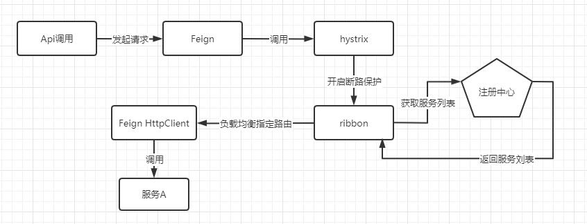

### Eureka 服务发现慢的原因

经常遇到注册中心的问题 :

1. 新服务上线后，服务消费者不能访问到刚上线的新服务，需要过一段时间后才能访问。
2. 服务下线后，服务还是会被调用到，一段时候后才彻底停止服务。

导致这个的问题是因为Eureka Server，Eureka Client，Ribbon为了提供性能，都有内置了缓存来记录服务信息。所以导致了需要等待一段时间才能获取到服务信息。

- Eureka Server 二级缓存（只读缓存，读写缓存）。只读缓存默认30秒与读写缓存进行同步，通过参数eureka.server.response-cache-update-interval-ms控制。读写缓存过期时间默认180秒，当服务下线，过期，注册，状态更变时会刷新此缓存。
- Eureka Client初始化了一个CacheRefreshThread 定时任务专门用来拉取 Eureka Server 的实例信息到本地。默认30秒，通过参数eureka.client.registry-fetch-interval-seconds控制。
- Ribbon缓存，通过ribbon.ServerListRefreshInterval控制。

#### **服务端缓存**

当Eureka Client注册到Eureka Server时，注册中心通过一个`双层的ConcurrentHashMap`来记录服务实例信息（纯内存的注册表提高了性能）。且为了能支撑每天千万级的高并发访问，Eureka Server同时也实现了一个`多级缓存机制`来保证，实现类为ResponseCacheImpl。

- readOnlyCacheMap，读缓存，结构是一个ConcurrentHashMap。
- readWriteCacheMap，读写缓存，结构是guava的Cache缓存。

**主动注册刷新缓存**

主动刷新，指的是应用实例(即`Eureka Client`端)在进行注册，续约租期，更新状态，删除时，会主动来刷新`readWriteCacheMap`中的数据。

```java
// AbstractInstanceRegistry类关键代码
// 这里只截取了注册相关代码，续约租期，更新状态，删除是类似的
public void register(InstanceInfo registrant, int leaseDuration, boolean isReplication) {
	try{
		......
		invalidateCache(registrant.getAppName(), registrant.getVIPAddress(), registrant.getSecureVipAddress());
		......
	}finally {
       read.unlock();
    }
}
private void invalidateCache(String appName, @Nullable String vipAddress, @Nullable String secureVipAddress) {
    responseCache.invalidate(appName, vipAddress, secureVipAddress);
}

// ResponseCacheImpl类关键代码
public void invalidate(Key... keys) {
    for (Key key : keys) {
        readWriteCacheMap.invalidate(key);
        ......
        for (Key keysWithRegion : keysWithRegions) {
            readWriteCacheMap.invalidate(keysWithRegion);
        }
        ......
    }
}
```

**被动更新缓存**

当参数shouldUseReadOnlyResponseCache（eureka.server.use-read-only-response-cache）为true时候，默认每隔30s（可以通过eureka.server.response-cache-update-interval-ms修改默认值）将`readWriteCacheMap`的数据刷入`readOnlyCacheMap`中。

```java
ResponseCacheImpl(EurekaServerConfig serverConfig, ServerCodecs serverCodecs, AbstractInstanceRegistry registry) {
    //关键代码    
     if (shouldUseReadOnlyResponseCache) {
         timer.schedule(getCacheUpdateTask(),
                 new Date(((System.currentTimeMillis() / responseCacheUpdateIntervalMs) * responseCacheUpdateIntervalMs)
                         + responseCacheUpdateIntervalMs),
                 responseCacheUpdateIntervalMs);
     }
}

private TimerTask getCacheUpdateTask() {
    return new TimerTask() {
        @Override
        public void run() {
            logger.debug("Updating the client cache from response cache");
            for (Key key : readOnlyCacheMap.keySet()) {
                if (logger.isDebugEnabled()) {
                    logger.debug("Updating the client cache from response cache for key : {} {} {} {}",
                            key.getEntityType(), key.getName(), key.getVersion(), key.getType());
                }
                try {
                    CurrentRequestVersion.set(key.getVersion());
                    Value cacheValue = readWriteCacheMap.get(key);
                    Value currentCacheValue = readOnlyCacheMap.get(key);
                    if (cacheValue != currentCacheValue) {
                        readOnlyCacheMap.put(key, cacheValue);
                    }
                } catch (Throwable th) {
                    logger.error("Error while updating the client cache from response cache for key {}", key.toStringCompact(), th);
                }
            }
        }
    };
}
```

**定时刷新缓存**

如果隔了一段时间，`readWriteCacheMap`读写缓存中的数据还没刷新的话，就会将此数据给过期删除掉。默认是180S，通过参数ResponseCacheAutoExpirationInSeconds（eureka.server.response-cache-auto-expiration-in-seconds=180）控制。当服务下线，过期，注册，状态更变等操作就会来清除此缓存中的数据。

```java
ResponseCacheImpl(EurekaServerConfig serverConfig, ServerCodecs serverCodecs, AbstractInstanceRegistry registry) {
    //采用guava的缓存框架
   this.readWriteCacheMap =
           CacheBuilder.newBuilder().initialCapacity(serverConfig.getInitialCapacityOfResponseCache())
                   .expireAfterWrite(serverConfig.getResponseCacheAutoExpirationInSeconds(), TimeUnit.SECONDS)
                   .removalListener(new RemovalListener<Key, Value>() {
                       @Override
                       public void onRemoval(RemovalNotification<Key, Value> notification) {
                           Key removedKey = notification.getKey();
                           if (removedKey.hasRegions()) {
                               Key cloneWithNoRegions = removedKey.cloneWithoutRegions();
                               regionSpecificKeys.remove(cloneWithNoRegions, removedKey);
                           }
                       }
                   })
                   .build(new CacheLoader<Key, Value>() {
                       @Override
                       public Value load(Key key) throws Exception {
                           if (key.hasRegions()) {
                               Key cloneWithNoRegions = key.cloneWithoutRegions();
                               regionSpecificKeys.put(cloneWithNoRegions, key);
                           }
                           Value value = generatePayload(key);
                           return value;
                       }
                   });

}
```

**Eureka Client如何获取服务实例信息**

Eureka Client 获取服务实例数据时，会先从一级缓存中获取，如果一级缓存中不存在，再从二级缓存中获取，如果二级缓存也不存在，会触发缓存的加载，从存储层拉取数据到缓存中，然后再返回给 Client。

#### **客户端缓存**

当Eureka Client从注册中心获取服务实例信息后，本身Client也会将信息缓存到本地。主要代码在DiscoveryClient.initScheduledTasks()方法中定义了CacheRefreshThread定时任务专门用来拉取 Eureka Server 的实例信息到本地。默认是30S，可以通过eureka.client.registry-fetch-interval-seconds控制。

Eureka Client从注册中心拉取服务实例信息的流程如下：

1. 首次全量拉取。
2. 定时通过CacheRefreshThread拉取增量服务实例，并通过比对hashcode来合并全量服务实例。

#### **Ribbon 缓存**

Ribbon会从Eureka Client中获取服务信息。ServerListUpdater 是 Ribbon 中负责服务实例更新的组件，默认的实现是PollingServerListUpdater，通过线程定时去更新实例信息。定时刷新的时间间隔默认是 30 秒。可以通过ribbon.ServerListRefreshInterval控制间隔时间。

以下是Ribbon各个组件作用：

- ILoadBalancer：定义一系列的操作接口，比如选择服务实例。
- IRule：算法策略，内置算法策略来为服务实例的选择提供服务。
- ServerList：负责服务实例信息的获取，可以获取配置文件中的，也可以从注册中心获取。
- ServerListFilter：过滤掉某些不想要的服务实例信息。
- ServerListUpdater：更新本地缓存的服务实例信息。
- IPing：对已有的服务实例进行可用性检查，保证选择的服务都是可用的。

### Fegin、Hystrix、Ribbon超时与重试



- Ribbon的全局超时时间通过`ribbon.ReadTimeout `和 `ribbon.ConnectTimeout`配置。
- Hyxstrix的全局超时时间通过`hystrix.command.default.execution.isolation.thread.timeoutInMilliseconds`配置。
- Fegin本身也有超时时间，通过`feign.client.config.default.connectTimeout`和`feign.client.config.default.connectTimeout`设置，但**如果设置了Ribbon的超时时间则以Ribbon的超时时间为准，Fegin自身的配置会被覆盖**。
- 由于Ribbon有重试机制，所以Hystrix的超时时间要大于Ribbon的超时时间。公式 `Hystrix的超时时间 > Ribbon的重试次数(包含首次) * (ribbon.ReadTimeout + ribbon.ConnectTimeout)`

这里需要明确Ribbon的重试机制。包括`同一台实例` 和 `另一个实例`的重试。所以Ribbon的重试次数公式如下：
$$
1 + ribbon.MaxAutoRetries  +  ribbon.MaxAutoRetriesNextServer
$$

```yml
ribbon:
  eager-load:
    enabled: true
  #说明：同一台实例的最大自动重试次数，默认为1次，不包括首次
  MaxAutoRetries: 1
  #说明：要重试的下一个实例的最大数量，默认为1，不包括第一次被调用的实例
  MaxAutoRetriesNextServer: 1
  #说明：是否所有的操作都重试，默认为true
  OkToRetryOnAllOperations: true
  #说明：从注册中心刷新服务器列表信息的时间间隔，默认为2000毫秒，即2秒
  ServerListRefreshInterval: 2000
  #说明：使用Apache HttpClient连接超时时间，单位为毫秒
  ConnectTimeout: 3000
  #说明：使用Apache HttpClient读取的超时时间，单位为毫秒
  ReadTimeout: 3000
```