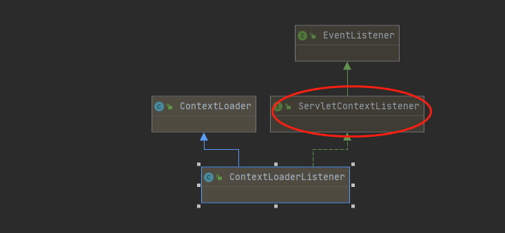
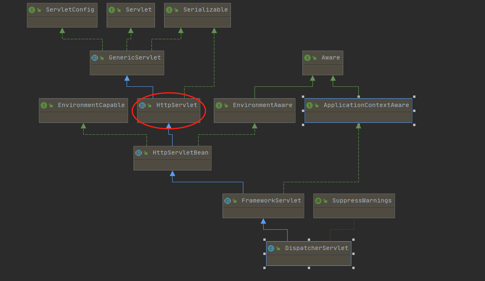
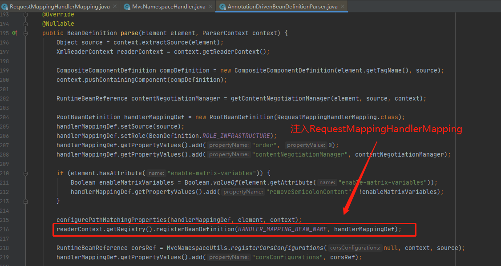
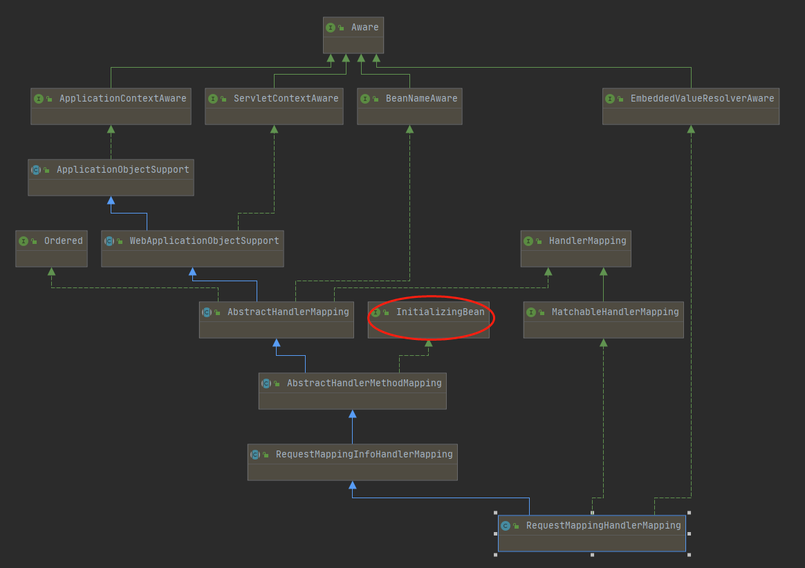
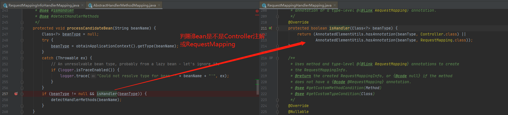
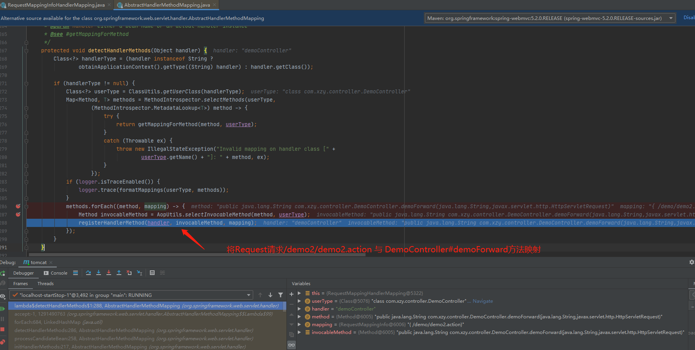
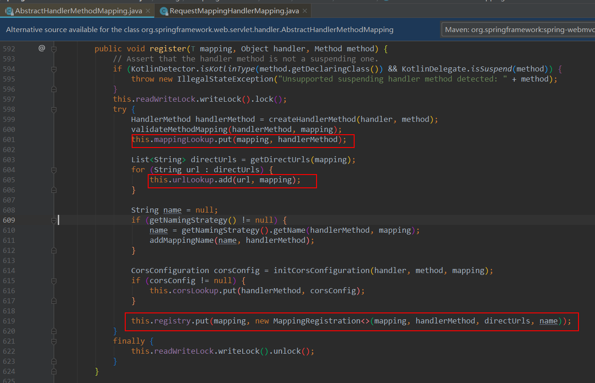

## SpringMVC初始化

### SpringMVC搭建流程

1.新建applicationContext.xml配置文件

```java
<?xml version="1.0" encoding="UTF-8"?>
<beans xmlns="http://www.springframework.org/schema/beans"
       xmlns:xsi="http://www.w3.org/2001/XMLSchema-instance"
       xmlns:context="http://www.springframework.org/schema/context"
       xmlns:tx="http://www.springframework.org/schema/tx"
       xsi:schemaLocation="http://www.springframework.org/schema/beans
        http://www.springframework.org/schema/beans/spring-beans.xsd
        http://www.springframework.org/schema/context
        http://www.springframework.org/schema/context/spring-context.xsd
        http://www.springframework.org/schema/tx
        http://www.springframework.org/schema/tx/spring-tx.xsd">
    <context:annotation-config/>
    <bean id="beanService" class="com.xzy.bean.BeanService"></bean>
    //...忽略其他配置
</bean>
</beans>
```

2.新建springmvc.xml配置文件

```java
<?xml version="1.0" encoding="UTF-8"?>
<beans xmlns="http://www.springframework.org/schema/beans"
       xmlns:xsi="http://www.w3.org/2001/XMLSchema-instance"
       xmlns:context="http://www.springframework.org/schema/context"
       xmlns:tx="http://www.springframework.org/schema/tx" xmlns:mvc="http://www.springframework.org/schema/mvc"
       xsi:schemaLocation="http://www.springframework.org/schema/beans
        http://www.springframework.org/schema/beans/spring-beans.xsd
        http://www.springframework.org/schema/context
        http://www.springframework.org/schema/context/spring-context.xsd
        http://www.springframework.org/schema/tx
        http://www.springframework.org/schema/tx/spring-tx.xsd http://www.springframework.org/schema/mvc https://www.springframework.org/schema/mvc/spring-mvc.xsd">

    <!-- 自动扫描该包，使SpringMVC认为包下用了@controller注解的类是控制器 -->
    <context:component-scan base-package="com.xzy.controller"/>
    <mvc:annotation-driven />
    <!-- 定义跳转的文件的前后缀 ，视图模式配置-->
    <bean class="org.springframework.web.servlet.view.InternalResourceViewResolver">
        <!-- 这里的配置我的理解是自动给后面action的方法return的字符串加上前缀和后缀，变成一个 可用的url地址 -->
        <property name="prefix" value="/WEB-INF/"/>
        <property name="suffix" value=".jsp"/>
    </bean>
</beans>
```

3.新建web.xml

```xml
 <!—创建Root WebApplicationContext-->
    <context-param>  
        <param-name>contextConfigLocation</param-name>  
        <param-value>classpath:applicationContext.xml</param-value>  
    </context-param>  
  
    <listener>  
        <listener-class>org.springframework.web.context.ContextLoaderListener</listener-class>  
    </listener>
    <!—创建Servlet WebApplicationContext-->
    <servlet>  
        <servlet-name>dispatcher</servlet-name>  
        <servlet-class>org.springframework.web.servlet.DispatcherServlet</servlet-class>  
        <init-param>  
            <param-name>contextConfigLocation</param-name>  
            <param-value>classpath:spring-mvc.xml</param-value>  
        </init-param>  
        <load-on-startup>1</load-on-startup>  
    </servlet>  
    <servlet-mapping>  
        <servlet-name>dispatcher</servlet-name>  
        <url-pattern>/*</url-pattern>  
    </servlet-mapping>
```

### SpringMVC父子容器

我们先来回顾下JavaWeb的三个组建：Listener(监听器)，Servlet，Filter。他们的作用如下 ：

- Listener，主要用来监听生命周期内的各种变化，例如监听servlet容器启动和关闭等
- Servlet，每个请求要经过的地方，提供了doGet方法，doPost方法
- Filter，过滤器，例如过滤一些不符合的请求

在web.xml我们定义了ContextLoaderListener监听器和DispatcherServlet的Servlet。他们分别用来加载父容器和子容器

- Root WebApplicationContext：这是对J2EE三层架构中的service层、dao层进行配置，如业务bean，数据源(DataSource)等。通常情况下，配置文件的名称为applicationContext.xml。在web应用中，其一般通过ContextLoaderListener来加载
- Servlet WebApplicationContext：这是对J2EE三层架构中的web层进行配置，如控制器(controller)、视图解析器(view resolvers)等相关的bean。通过spring mvc中提供的DispatchServlet来加载配置，通常情况下，配置文件的名称为spring-servlet.xml

**为什么要有父子容器?**

父子容器的作用主要是划分框架边界。

## ContextLoaderListener详解

ContextLoaderListener实现了ServletContextListener接口，所以它能够监听 ServletContext 对象的生命周期。在Web应用启动时会调用contextInitialized方法加载applicationContext.xml对应的Bean。也就是我们说的父容器的东西，包括三层架构中的service层、dao层进行配置，如业务bean。



## DispatcherServlet初始化

### httpServlet初始化init



DispatcherServlet集成HttpServlet类，所以在容器启动后会执行init()方法。主要做的事包括

- 加载Spring-mvc.xml对应的容器

- 通过解析自定义标签<mvc:annotation-driven /> ，往容器中注入处理映射器(HandlerMapping)，处理映射器(HandlerAdapter)，视图控制器等。

  流程如下：\<mvc:annotation-driven\/> -----》 MvcNamespaceHandler#init() -----》 AnnotationDrivenBeanDefinitionParser#parse()

- 执行initStrategies初始化方法



```java
//执行initStrategies初始化方法
protected void initStrategies(ApplicationContext context) {
	//初始化文件上传
	initMultipartResolver(context);
	//初始化国家化
	initLocaleResolver(context);
	//初始化主题
	initThemeResolver(context);
	//初始化处理映射器
	initHandlerMappings(context);
	//初始化处理适配器
	initHandlerAdapters(context);
	//初始化请求异常
	initHandlerExceptionResolvers(context);
	//初始化请求视图名
	initRequestToViewNameTranslator(context);
	//初始化视图解析器
	initViewResolvers(context);
	//
	initFlashMapManager(context);
}
```


### 映射处理器HandlerMapping

SpringMVC 内部是根据 `HandlerMapping` 将 `Request` 和 `Controller` 里面的方法对应起来的。在初始化后就会将这个映射注册到mappingRegistry.java类中。后面请求过来的时才可以通过url找到对应的Controller方法进行处理。映射处理器在Web启动后，自动加载了RequestMappingHandlerMapping.java 和 BeanNameUrlHandlerMapping.java。他们分别对应不同的处理方式。

接下来我们通过RequestMappingHandlerMapping.java来了解下是如何将Request和Controller映射起来的。



RequestMappingHandlerMapping实现了InitializingBean接口，所以在对象实例化后会执行afterPropertiesSet方法。具体链路如下：

1. RequestMappingHandlerMapping#afterPropertiesSet()
2. AbstractHandlerMethodMapping#initHandlerMethods() 
3. AbstractHandlerMethodMapping#processCandidateBean(beanName)
4. AbstractHandlerMethodMapping#detectHandlerMethods(beanName)
5. AbstractHandlerMethodMapping#registerMapping()
6. AbstractHandlerMethodMapping#register(T mapping, Object handler, Method method)







所以说HandlerMapping主要是将请求和对应的处理类(Handler)对应起来。例如我们Controller可以是如下两种定义方式：

```java
//采用注解方式@Controller 和 @RequestMapping
@Controller
@RequestMapping(value = "/demo")
public class DemoController {
    @RequestMapping(value = "/demo1.action")
    @ResponseBody
    public Map demo1() {
        //..省略很多代码
    }
}

//通过实现Controller方法的方式
public class OtherController implements Controller {
    public ModelAndView handleRequest(HttpServletRequest request, HttpServletResponse response) throws Exception {
        ModelAndView mv = new ModelAndView();
        mv.addObject("hello","world");
        mv.setViewName("result");
        return mv;
    }
}
<bean id="/other.action" class="com.xzy.controller.OtherController"></bean>
```

HandlerMapping通过不同的实现类来将url和handler映射起来。后面执行getHandler()方法时，就可以通过url找到对应的handler。并将handler+多个HandlerInterceptor拦截器封装成HandlerExecutionChain对象。

### 处理适配器(HandlerAdapter)

HandlerAdapter将会根据适配的结果调用真正的处理器的功能处理方法，完成功能处理；并返回一个ModelAndView对象（包含模型数据、逻辑视图名）。由于handler是有不同的实现方式，例如是实现Controller还是使用@Controller注解，所以需要使用适配器的方式找到不通方式的处理器。系统默认提供了处理适配器来对应不同方式的handler。

- RequestMappingHandlerAdapter.java
- HttpRequestHandlerAdapter.java
- SimpleControllerHandlerAdapter.java

