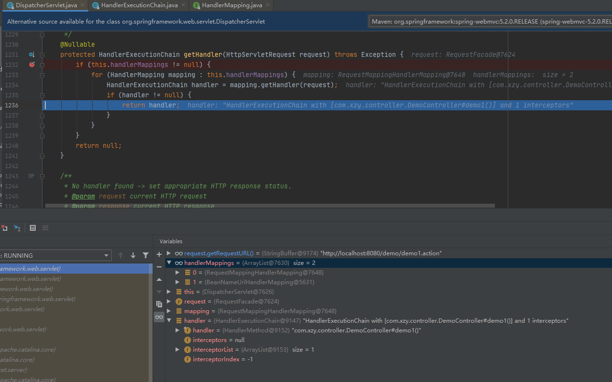
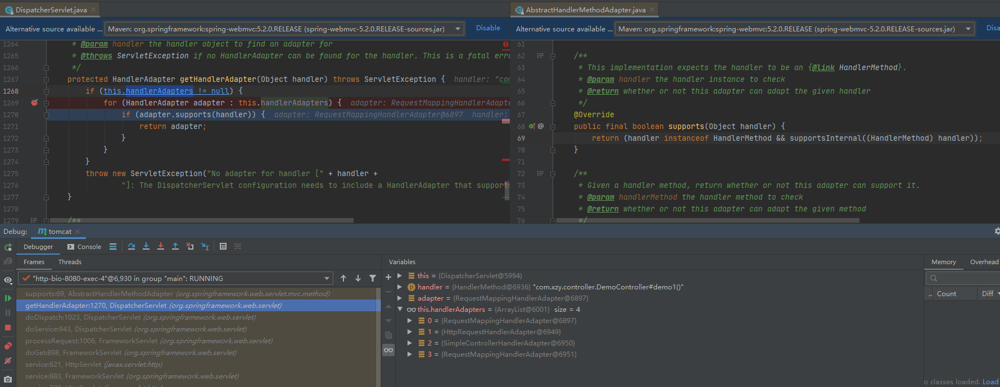

## SpringMVC工作流程

### 工作流程概述

- 客户端（浏览器）发送请求，直接请求到 DispatcherServlet
- DispatcherServlet 根据请求信息调用 HandlerMapping，解析请求对应的 Handler
- 解析到对应的 Handler（也就是我们平常说的 Controller 控制器）后，开始由 HandlerAdapter 适配器处理
- HandlerAdapter 会根据 Handler 来调用真正的处理器开处理请求，并处理相应的业务逻辑
- 处理器处理完业务后，会返回一个 ModelAndView 对象，Model 是返回的数据对象，View 是个逻辑上的 View
- ViewResolver 会根据逻辑 View 查找实际的 View
- DispaterServlet 把返回的 Model 传给 View（视图渲染）
- 把 View 返回给请求者（浏览器）

### 流程分析

<font size=4 color=red>第一步：客户端（浏览器）发送请求，直接请求到DispatcherServlet</font>

前面说过SpringMVC是遵循Sevlet规范的。且DispatcherServlet继承了HttpServlet。所以请求会通过HttpServlet的doGet方法或者doPost方法处理。所以我们在根据DispatcherServlet及其父类上需要doGet和doPost入口。


所以，我们最终请求会到DispatcherServlet类中的doDispatch方法中进行处理。

```java
protected void doDispatch(HttpServletRequest request, HttpServletResponse response) throws Exception {
	HttpServletRequest processedRequest = request;
	HandlerExecutionChain mappedHandler = null;
	boolean multipartRequestParsed = false;

	WebAsyncManager asyncManager = WebAsyncUtils.getAsyncManager(request);

	try {
		ModelAndView mv = null;
		Exception dispatchException = null;

		try {
			processedRequest = checkMultipart(request);
			multipartRequestParsed = (processedRequest != request);

			//DispatcherServlet 根据请求信息调用 HandlerMapping，解析请求对应的 Handler
			mappedHandler = getHandler(processedRequest);
			if (mappedHandler == null) {
				noHandlerFound(processedRequest, response);
				return;
			}

			// 解析到对应的 Handler（也就是我们平常说的 Controller 控制器）后，开始由 HandlerAdapter 适配器处理
			HandlerAdapter ha = getHandlerAdapter(mappedHandler.getHandler());

			
			String method = request.getMethod();
			boolean isGet = "GET".equals(method);
			if (isGet || "HEAD".equals(method)) {
				long lastModified = ha.getLastModified(request, mappedHandler.getHandler());
				if (new ServletWebRequest(request, response).checkNotModified(lastModified) && isGet) {
					return;
				}
			}
			//执行前置拦截器
			if (!mappedHandler.applyPreHandle(processedRequest, response)) {
				return;
			}

			// HandlerAdapter 会根据 Handler 来调用真正的处理器开处理请求，并处理相应的业务逻辑
			// 处理器处理完业务后，会返回一个 ModelAndView 对象，Model 是返回的数据对象，View 是个逻辑上的 View
			mv = ha.handle(processedRequest, response, mappedHandler.getHandler());

			if (asyncManager.isConcurrentHandlingStarted()) {
				return;
			}
			//解析默认的视图
			applyDefaultViewName(processedRequest, mv);
			//执行后置拦截器
			mappedHandler.applyPostHandle(processedRequest, response, mv);
		}
		catch (Exception ex) {
			dispatchException = ex;
		}
		catch (Throwable err) {
			
			dispatchException = new NestedServletException("Handler dispatch failed", err);
		}
		//处理转发结果
		processDispatchResult(processedRequest, response, mappedHandler, mv, dispatchException);
	}
	catch (Exception ex) {
		//异常执行拦截器的完成事件
		triggerAfterCompletion(processedRequest, response, mappedHandler, ex);
	}
	catch (Throwable err) {
		triggerAfterCompletion(processedRequest, response, mappedHandler,
				new NestedServletException("Handler processing failed", err));
	}
	finally {
		if (asyncManager.isConcurrentHandlingStarted()) {
			// 处理异步请求
			if (mappedHandler != null) {
				mappedHandler.applyAfterConcurrentHandlingStarted(processedRequest, response);
			}
		}
		else {
			// 清空上传的临时文件
			if (multipartRequestParsed) {
				cleanupMultipart(processedRequest);
			}
		}
	}
}
```

<font size=4 color=red>第二步：DispatcherServlet 根据请求信息调用 HandlerMapping，解析请求对应的 Handler并封装成HandlerExecutionChain对象(一个Handler + 多个HandlerInterceptor拦截器)</font>

通过遍历handlerMappings找到请求对应的Handler，并将Handler + 拦截器 封装成HandlerExecutionChain对象。



<font size=4 color=red>第三步：通过Handler找到对应的处理器适配器（HandlerAdapter）</font>

HandlerAdapter采用了适配器模式提供了两个方法 ：

- boolean supports(Object handler)  -- 判断参数的handler是不是我这个适配器可以处理的处理器。
- ModelAndView handle(HttpServletRequest request, HttpServletResponse response, Object handler)  -- 处理并返回ModelAndView



例如RequestMappingHandlerAdapter适配器，他判断如果这个handler是HandlerMethod则这个handler使用他来进行处理。

<font size=4 color=red>第四步：执行handler前先执行拦截器的前置拦截</font>

拦截器提供的3个方法：

- **preHandle** - 该方法将在请求处理之前进行调用
- **postHandle** - Controller 处理之后的ModelAndView 对象进行，此时视图还没做渲染
- **afterCompletion** - 渲染了视图后执行，主要是清理资源等

```java
//mappedHandler.applyPreHandle(processedRequest, response);
boolean applyPreHandle(HttpServletRequest request, HttpServletResponse response) throws Exception {
	HandlerInterceptor[] interceptors = getInterceptors(); //获取定义的拦截器
	if (!ObjectUtils.isEmpty(interceptors)) {
		for (int i = 0; i < interceptors.length; i++) {
			HandlerInterceptor interceptor = interceptors[i];
             //执行前置拦截
			if (!interceptor.preHandle(request, response, this.handler)) {
				triggerAfterCompletion(request, response, null);
				return false;
			}
			this.interceptorIndex = i;
		}
	}
	return true;
}
```

<font size=4 color=red>第五步：调用HandlerAdapter(处理器适配器)执行handler并返回ModelAndView</font>

```java
mv = ha.handle(processedRequest, response, mappedHandler.getHandler());
```