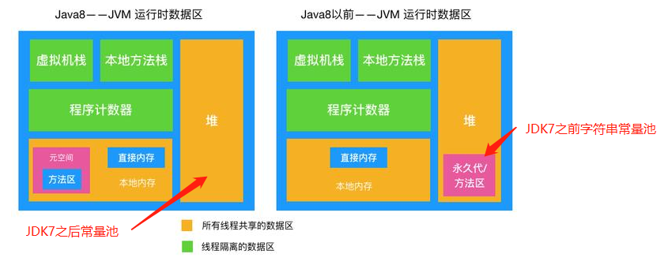

## 前言
经常看网上博客，发现很多文章用了常量池，class常量池，运行时常量池，字符串常量池。傻傻分不清楚他们之间有什么区别。
## 常量池和class常量池
其实，常量池 = Class常量池。

常量池,也叫 Class 常量池。Java文件被编译成 Class文件，Class文件中除了包含类的版本、字段、方法、接口等描述信息外，还有一项就是常量池，常量池是当Class文件被Java虚拟机加载进来后存放在方法区各种字面量 (Literal)和 符号引用 。

## 运行时常量池
运行时常量池是方法区的一部分。

运行时常量池是当Class文件被加载到内存后，Java虚拟机会将Class常量池里的内容转移到运行时常量池里(运行时常量池也是每个类都有一个)。

运行时常量池相对于Class常量池的另外一个重要特征是具备动态性，Java语言并不要求常量一定只有编译期才能产生，也就是并非预置入Class文件中常量池的内容才能进入方法区运行时常量池，运行期间也可能将新的常量放入池中。
<!--more-->

## Class常量池和运行时常量池关系

## 字符串常量池
字符串常量池又称为：字符串池，全局字符串池,英文也叫String Pool。
JVM为了提升性能和减少内存开销,避免字符串重复创建，所以维护了一块特殊的内存空间，字符串常量池。

在JDK7之前，字符串常量池是存在在永久代里，JDK7以后转移到了堆里面

## 总结

- String常量池在每个JVM中只有一份，存放的是字符串常量的引用值。
- class常量池是在编译的时候每个class都有的，在编译阶段，存放的是常量的符号引用。
- 运行时常量池是在类加载完成之后，将每个class常量池中的符号引用值转存到运行时常量池中，也就是说，每个class都有一个运行时常量池，类在解析之后，将符号引用替换成直接引用，与全局常量池中的引用值保持一致。

## 参考

- [详解JVM常量池、Class、运行时、字符串常量池](https://www.baidu.com/link?url=M8Bauh76JXr4VhFH84A2uK6PkDyDwfw8Si1uo23sMjKXirLJF2BHwIutcY1jMBx03jjyPJmnrXVVMyt_N_-jP_&wd=&eqid=b278744100018add000000065f237350)
- [字符串常量池、class常量池和运行时常量池](https://blog.csdn.net/u011552955/article/details/100079685)