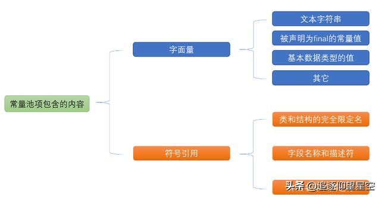
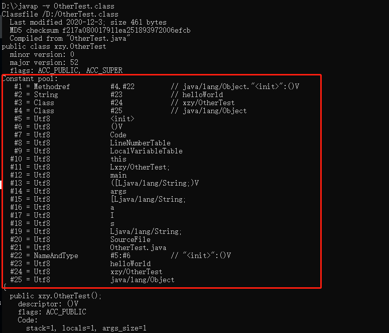
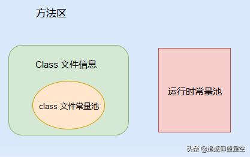
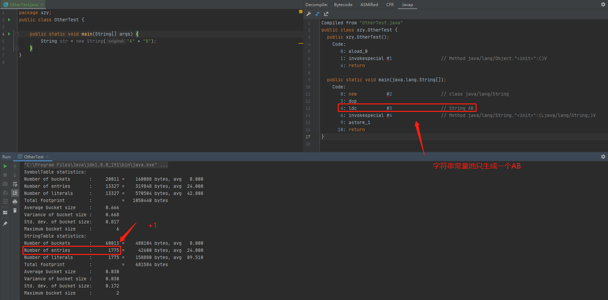

## 前言
经常看网上博客，发现很多文章用了常量池，class常量池，运行时常量池，字符串常量池。傻傻分不清楚他们之间有什么区别。
## 常量池和class常量池
其实，常量池 <font color=red>=</font> Class常量池。

常量池,也叫 Class 常量池。Java文件被编译成 Class文件，Class文件中除了包含类的版本、字段、方法、接口等描述信息外，还有一项就是常量池，Class常量池可以理解为是Class文件中的资源仓库。用于存放编译器生成的各种`字面量`和`符号引用`。



<!--more-->

如，我们有如下代码

```java
public class OtherTest {
    public static void main(String[] args) {
        int a = 11;
        String s = "helloWorld";
    }
}
```

使用 javap -v OtherTest.class查看



### 字面量

前面说过，运行时常量池中主要保存的是字面量和符号引用，那么到底什么字面量？说简单点，字面量就是指由字母、数字等构成的字符串或者数值。

字面量只可以右值出现，所谓右值是指等号右边的值，如：int a=11这里的a为左值，11为右值。在这个例子中11就是字面量。上面的代码中`11`和`helloWorld`都是字面量。

### 符号引用

符号引用是编译原理中的概念，是相对于直接引用来说的。主要包括了以下三类常量： * 类和接口的全限定名 * 字段的名称和描述符 * 方法的名称和描述符。这也就可以印证前面的常量池中还包含一些`xzy//OtherTest`、`main`、`([Ljava/lang/String;)V`等常量的原因了。

## 运行时常量池

运行时常量池是<font color=red>方法区的一部分</font>。

运行时常量池是当Class文件被加载到内存后，Java虚拟机会将Class常量池里的内容转移到运行时常量池里(<font color=red>运行时常量池也是每个类都有一个</font>)。

运行时常量池相对于Class常量池的另外一个重要特征是具备动态性，Java语言并不要求常量一定只有编译期才能产生，也就是并非预置入Class文件中常量池的内容才能进入方法区运行时常量池，运行期间也可能将新的常量放入池中。


## Class常量池和运行时常量池关系



## 字符串常量池
字符串常量池又称为：字符串池，全局字符串池,英文也叫String Pool（<font color=red>一组指针指向Heap中的String对象的内存地址</font>）。
JVM为了提升性能和减少内存开销,避免字符串重复创建，所以维护了一块特殊的内存空间，字符串常量池。在JDK7之前，字符串常量池是存在在永久代里，JDK7以后转移到了堆里面。

**哪些字符串会放到字符串常量池中?**

我们可以把我们在代码上经常用到的字符串分成下面这几类

- 全局变量直接声明(包含静态变量)，例如 public static final String str = "hello"
- 局部变量直接声明，String str = "hello"
- 程序中动态生成的字符串，例如动态拼接，从文件读取出来的字符串等。
- 通过new声明，String str = new String()

下面，进行测试，这里有个知识点，增加JVM参数<font color=red>-XX:+PrintStringTableStatistics</font>可以打印出字符串常量池的量。

```java
public class OtherTest {
    public static void main(String[] args){
    	//空代码
    }
}
//输出 空代码时候，字符串常量池中的量为1774
StringTable statistics:
Number of buckets       :     60013 =    480104 bytes, avg   8.000
Number of entries       :      1774 =     42576 bytes, avg  24.000
Number of literals      :      1774 =    158832 bytes, avg  89.533
Total footprint         :           =    681512 bytes
```

结论1：字面字符串常量会进入到字符串常量池中
```java
public class OtherTest {
    public static void main(String[] args){
    	String str = "hello";
    }
}
//输出，字符串常量池的量+1，字面字符串常量会进入到字符串常量池
StringTable statistics:
Number of buckets       :     60013 =    480104 bytes, avg   8.000
Number of entries       :      1775 =     42600 bytes, avg  24.000
Number of literals      :      1775 =    158888 bytes, avg  89.514
Total footprint         :           =    681592 bytes
```
结论2：相同的字面字符串只在字符串常量池创建一份，另外一份复用
```java
public class OtherTest {
    public static void main(String[] args){
    	String str = "hello";
        String str2 = "hello";
    }
}
//输出，字符串常量池的量1775，所以说str，str2是同一个，str2没有继续创建一个新的，优化了空间
StringTable statistics:
Number of buckets       :     60013 =    480104 bytes, avg   8.000
Number of entries       :      1775 =     42600 bytes, avg  24.000
Number of literals      :      1775 =    158888 bytes, avg  89.514
Total footprint         :           =    681592 bytes
```

结论3：new字符串对象的情况，也会在字符串常量池创建一个

```java
public class OtherTest {
    public static void main(String[] args){
    	String str = new String("hello");
    }
}
//输出字符串常量池的量1775
StringTable statistics:
Number of buckets       :     60013 =    480104 bytes, avg   8.000
Number of entries       :      1775 =     42600 bytes, avg  24.000
Number of literals      :      1775 =    158888 bytes, avg  89.514
Total footprint         :           =    681592 bytes
```

结论4：代码中动态创建的字符串不会进入字符串常量池

```java
public class OtherTest {
    public static void main(String[] args) {
        for (int i = 0; i < 10; i++) {
            String temp = String.valueOf(i);
        }
    }
}
#常量池没变
StringTable statistics:
Number of buckets       :     60013 =    480104 bytes, avg   8.000
Number of entries       :      1774 =     42576 bytes, avg  24.000
Number of literals      :      1774 =    158832 bytes, avg  89.533
Total footprint         :           =    681512 bytes
```

结论5：intern方法可以主动让字符串进入常量池

```java
public class OtherTest {
    public static void main(String[] args) {
        for (int i = 0; i < 10; i++) {
            String temp = String.valueOf(i).intern();
        }
    }
}
//量增加了10
StringTable statistics:
Number of buckets       :     60013 =    480104 bytes, avg   8.000
Number of entries       :      1784 =     42816 bytes, avg  24.000
Number of literals      :      1784 =    159312 bytes, avg  89.300
Total footprint         :           =    682232 bytes
```

**面试常见：String str = new String("hello")创建了几个对象**

通过javap反编译代码，具体看创建了几个对象

```java
package xzy;
public class OtherTest {
    public static void main(String[] args) {
        String str = new String("hello");
    }
}

//反编译输出
Compiled from "OtherTest.java"
public class xzy.OtherTest {
  public xzy.OtherTest();
    Code:
       0: aload_0
       1: invokespecial #1                  // Method java/lang/Object."<init>":()V
       4: return

  public static void main(java.lang.String[]);
    Code:
       0: new           #2                  // class java/lang/String    -- new一个String对象
       3: dup                                                            -- 压入(dup)到栈顶
       4: ldc           #3                  // String hello              -- 从常量池中(ldc)初始化hello字符串
       6: invokespecial #4                  // Method java/lang/String."<init>":(Ljava/lang/String;)V --构造函数初始化(invokespecial)对象
       9: astore_1                            --将对象引用赋值(astore_1)给本地变量str     
      10: return
}
```

所以，在常量池没有hello的情况下，创建了两个对象和一个引用。

再来看看`String str = new String("A" + "B")` 生成了几个对象。

从下图看，在字符串常量池里面只有+1。我看网上对于这个问题是说字符串常量池里面生成了A,B,AB三个，其实是只有一个，因为在编译有做了优化，会将A+B变成AB。这个只需要将class文件进行反编译就知道了。所以字符串常量池里面只有一个。



**疑问：在JVM中，字符串常量到底存放到哪里**

例如 `String str = "ABC"` ，那么“ABC”这个对象是放在内存中的哪个位置，<font color=red>是字符串常量池还是堆</font>？

看网上的回答 ：abc当然在字符串常量池中，只有new String("abc")这个对象在堆中创建。<font color=red>abc这个东西放在常量池中，这个答案是错误的。</font>

**正确答案：<font color=green>字符串abc的本体，实例应该是存在在JVM的堆中。</font>**

```java
public static void main(String[] args){
	String str = "hello";
}
```

1. 首先，字面量 "hello" 在编译期，就会被记录在class文件的class常量池。
2. 而当 class文件被加载到内存中后，JVM就会将class常量池中的大部分内容存放到运行时常量池中，但是字符串 "hello" 的本体（对象）和其他所有对象一样，是会在堆中创建，再将引用放到字符串常量池。
3. 而到了String str = "hello"这一步，JVM会去字符串常量池中找，如果找到了，JVM会在栈中的局部变量表中创建str变量，然后把字符串常量池中的（hello对象的）引用复制给str变量。

**疑问：JVM中字符串常量池会进行垃圾回收吗？**

会，假设一个字符串”everor”已经进入了常量池，但是当前系统中没有一个String对象引用常量池中的”everor”常量（即String str = new String(“everor”);），也没有其他地方引用了这个字面量（即String str = “everor”;），如果这个时候发生了内存回收，而且有必要的话，这个”everor”常量就会被系统清理出常量池。

## 总结

- String常量池在每个JVM中只有一份，存放的是字符串常量的引用值。
- class常量池是在编译的时候每个class都有的，在编译阶段，存放的是常量的符号引用。
- 运行时常量池是在类加载完成之后，将每个class常量池中的符号引用值转存到运行时常量池中，也就是说，每个class都有一个运行时常量池，类在解析之后，将符号引用替换成直接引用，与全局常量池中的引用值保持一致。

## 参考

- [详解JVM常量池、Class、运行时、字符串常量池](https://www.baidu.com/link?url=M8Bauh76JXr4VhFH84A2uK6PkDyDwfw8Si1uo23sMjKXirLJF2BHwIutcY1jMBx03jjyPJmnrXVVMyt_N_-jP_&wd=&eqid=b278744100018add000000065f237350)
- [字符串常量池、class常量池和运行时常量池](https://blog.csdn.net/u011552955/article/details/100079685)
- https://segmentfault.com/a/1190000017952075?utm_source=tag-newest
- https://mrdear.cn/posts/java-string-pool.html