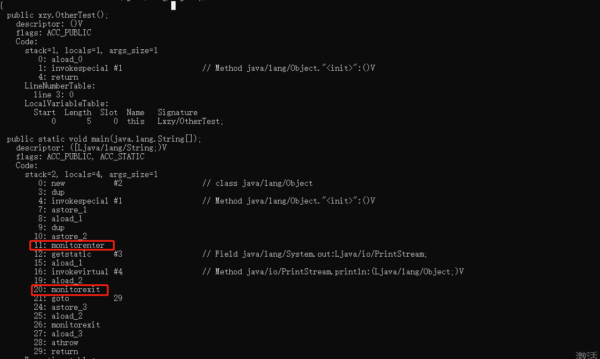
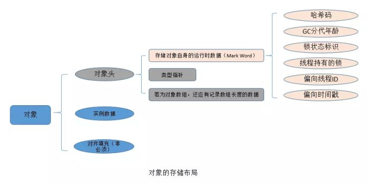
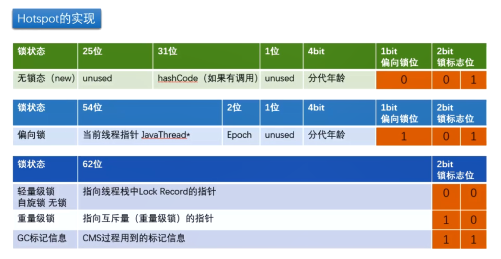
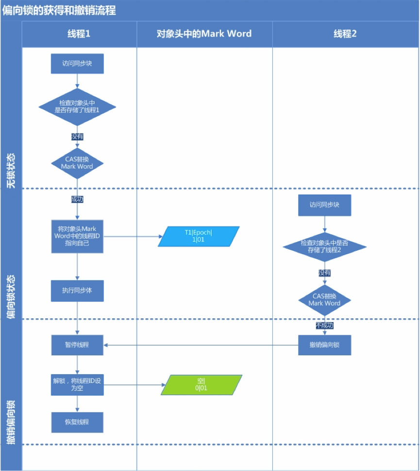
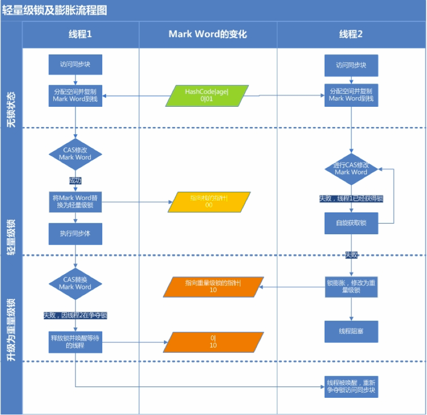
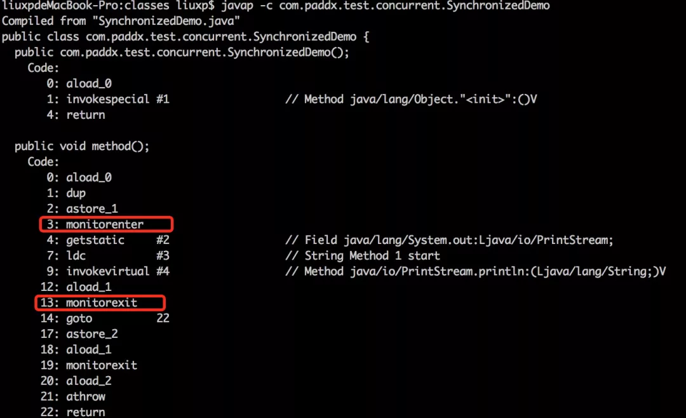

## 概念

synchronized是java提供的原子性内置锁，这种内置的并且使用者看不到的锁也被称为**监视器锁**，使用synchronized之后，会在编译之后在同步的代码块前后加上monitorenter和monitorexit字节码指令，他依赖操作系统底层互斥锁实现。他的作用主要就是实现原子性操作和解决共享变量的内存可见性问题。


## synchronized使用方法

|              | 锁的是什么        | 代码                                                         |
| ------------ | ----------------- | ------------------------------------------------------------ |
| 修饰实例方法 | 方法对应的new对象 | public synchronized void doSome(){}                          |
| 修饰静态方法 | 静态方法对应的类  | public static synchronized void doSome(){}                   |
| 修饰代码块1  | 方法对应的new对象 | public void doSome(){<br/>	&nbsp;&nbsp;&nbsp;synchronized(this){<br/>	 &nbsp;&nbsp;&nbsp; ...<br/>	&nbsp;}<br/>} |
| 修饰代码块2  | 括号内的类        | public void doSome(){<br/>	&nbsp;synchronized(Dog.class){<br/>	 &nbsp;&nbsp; ...<br/>	&nbsp;}<br/>} |

## synchronized原理

如下代码，使用`javap -v OtherTest.class` 解析。

```java
public class OtherTest {
    public static void main(String[] args) {
        Object o = new Object();
        synchronized (o){
            System.out.println(o);
        }
    }
}
```

<!--more-->



如下图所示，synchronized的再JVM里的实现原理是<font color=red>JVM基于进入和退出Monitor对象来实现方法同步和代码块同步</font>，主要是使用`monitorenter`和`monnitorexit`指令实现。[java并发系列-monitor机制实现](https://www.cnblogs.com/qingshan-tang/p/12698705.html)。

## 什么是锁升级？

JDK6以前synchronized锁实现都是重量级锁的形式，效率低下，为了提升效率进行了优化，所以出现了锁升级的过程。在JDK6之前每次调用synchronized加锁时都需要进行系统调用，系统调用会涉及到用户态和系统态的切换，此过程比较复杂且时间长导致了synchronized效率底下。所以在JDK6以后提出了锁升级的概念。

synchronized锁升级包括如下几个状态，级别从低到高分别是：<font color=red>无锁状态、偏向锁状态、轻量锁状态、重量锁状态</font>。这里需要注意的是锁升级过程中提到的偏向锁、轻量锁、重量锁都是synchronized锁的具体实现所要经历的过程，<font color=red>他们并不是单独的锁</font>。

## 锁升级原理

<font color=red>synchronized锁的是对象</font>。在JVM中每个对象都是有由三部分组成的 ：对象头、实例数据、数据填充。<font color=red>synchronized的锁的信息都是存储在对象头里</font>。



我们可以看到对象头中有一个MarkWord。<font color=red>锁升级就是markWord里面标志位的变化</font>。这里我们主要看后面的锁标志位，不同的标志位代表不同的锁状态。大家发现一共有五种状态，用两位是不够的，所以01的时候在向前借一位。



### 偏向锁状态

***偏向锁产生的原因？*** 大多数情况下，锁不仅不存在多线程竞争，而且总是由同一线程多次获得，为了让线程获得锁的代价更低而引入了偏向锁。



- 当一个线程A访问同步块时，如果发现MarkWord没有存储线程ID，那判定是无锁状态，此时通过CAS方式试图将自己的线程ID存储到MarkWord中
- 线程A判断当前MardWord存储的线程是不是自己的线程ID？如果是直接获得锁(此时MarkWord上是线程IDA)。并把标志为改成01，表示现在是偏向锁状态。
- 执行同步体
- 假设在期间有了线程B来争抢，由于此时MardWord上是线程A的ID，所以线程B执行CAS失败。此时线程B阻塞，并撤销偏向锁,升级为轻量级锁。

所以，偏向锁是<font color=red>在同一个线程加锁的情况下，不存在多个线程竞争只需要判断线程指针是否同一个，可直接执行同步代码块</font>。适用于一个线程反复进入同步块的时候。

<font color=red>如果有其他线程已经获得了偏向锁，这种情况说明当前锁存在竞争，需要撤销已获得偏向锁的线程，并且把它持有的锁升级为轻量级锁</font>（这个操作需要等到全局安全点，也就是没有线程在执行字节码）才能执行。

### 轻量级锁

当出现锁竞争时，会升级为轻量级锁。



每个线程在自己的线程栈生成LockRecord（用于存储锁记录的空间）。用CAS操作将markword设置为指向自己这个线程的LockRecord的指针，设置成功者得到锁。假设线程A通过CAS设置成功了，线程A获得锁。线程B由于CAS失败，只能<font color=red>重复自旋</font>。一般自旋次数10次，如果10次之后或者自旋线程数超过CPU核数的一半。那么此时升级为重量级锁。

当然并不是都是10次，JDK6引入了<font color=red>自适应自选锁</font>。自适应意味着自旋的次数不是固定不变的，而是根据前一次在同一个锁上自旋的时间以及锁的拥有者的状态来决定。(如果在同一个锁对象上，自旋等待刚刚成功获得过锁，并且持有锁的线程正在运行中，那么虚拟机就会认为这次自旋也是很有可能再次成功，进而它将允许自旋等待持续相对更长的时间。如果对于某个锁，自旋很少成功获得过，那在以后尝试获取这个锁时将可能省略掉自旋过程，直接阻塞线程，避免浪费处理器资源)

所以，可以总结轻量级锁出现在<font color=red>多个锁出现竞争的情况下，且多个线程之间是交替执行的</font>。这个要区别于下面说的重量级锁，假设多个线程之间是交替在执行同步块，也就是说自旋没超过条件，此时还是用轻量级锁。

### 重量级锁

当多个线程出现竞争，且不是那种交替的情况下。此时升级成了重量级锁。

在重量级锁中将LockRecord对象替换为了monitor对象的实现。主要通过<font color=red>monitorenter</font>和<font color=red>monitorexit</font>两个指令来实现。需要经过系统调用，在并发低的情况下效率会低。

通过反编译查看，如下图



java中每个对象都关联了一个监视器锁monitor，当monitor被占用时就会处于锁定状态。线程执行monitorenter 指令时尝试获取monitor的所有权。<font color=red>monitor是可重入的，有计数器，且是非公平的</font>。<font color=red>monitor 依赖操作系统的mutexLock(互斥锁)来实现的，线程被阻塞后便进入内核（Linux）调度状态，这个会导致系统在用户态与内核态之间来回切换，严重影响锁的性能</font>。

## 锁清除

编译器会清除一些使用了同步，但同步块中没有涉及共享数据的锁，从而减少多余的同步。

例如StringBuffer类。我们可以看StringBuffer类是线程安全的，因为他的方法用了synchronized修饰过，但是在使用上，我们经常是直接在方法内部new一个StringBuffer类，这样的情况其实StringBuffer是没有竞争的，但是他还是用了synchronized修饰，此时编译器会进行锁清除。

```java
//方法内部创建了StringBuffer并不会出现锁竞争的情况。
public void addStr(String buffer){
	StringBuffer sb = new StringBuffer();
	sb.append("1").append("2");
	return sb.toString(); 
}
```

## 锁粗化

若有一系列操作，反复地对同一把锁进行上锁和解锁操作，编译器会扩大这部分代码的同步块的边界，从而只使用一次上锁和解锁操作。

## 总结

JDK6对synchronized做了锁优化，使其适应了各种情况，包括<font color=red>只有一个线程多次访问同步块、多个线程交替访问同步块、多个线程争抢同步块</font>。不同的情况对应不通的锁状态，当然<font color=red>锁可以升级但不能降级</font>。也在编译器层面做了锁清除和锁粗化的优化。

本文没有深入研究底层编译器原理，只是对synchronized的锁升级做了介绍，了解synchronized是怎么不通情况下对应不同的锁状态来达到优化的。

也是JDK6以后synchronized性能有了提升，现在用synchronized的性能几乎和AQS什么太大区别。在原理上也是借鉴了AQS上的CAS操作。

## 参考

- https://mp.weixin.qq.com/s/OAO7PGdKemLbdNb6bYtq-w

