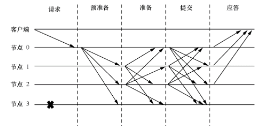
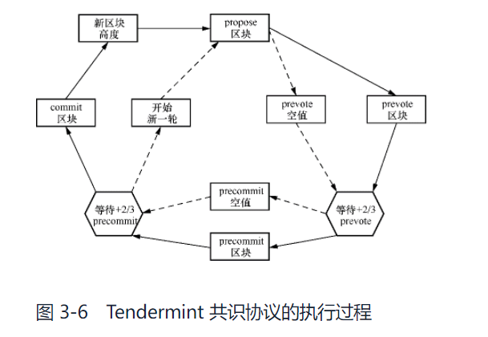
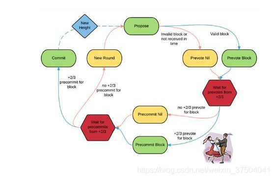
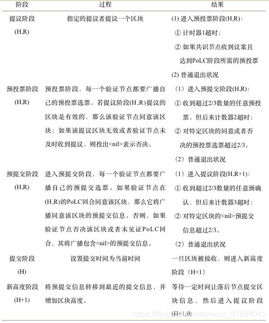

### 搭建模式


验证器将只与提供的哨兵通话，哨兵节点将通过秘密连接与验证器通信，网络的其余部分通过正常连接与验证器通信。哨兵节点也有相互通信的选项。`config.toml`初始化节点时，可能需要更改其中的五个参数：

- `mode:`(full | validator | seed) 节点模式（默认值：'full'）。如果要将节点作为验证器运行，请将其更改为“验证器”。
- `pex:`布尔值。这将打开或关闭节点的对等交换反应器。当 时`pex=false`，只有`persistent-peers`列表可用于连接。
- `persistent-peers:`一个逗号分隔的`nodeID@ip:port`值列表，定义了预期始终在线的对等点列表。这在第一次启动时是必要的，因为通过设置`pex=false`节点将无法加入网络。
- `unconditional-peer-ids:`逗号分隔的 nodeID 列表。无论入站和出站对等点的限制如何，这些节点都将连接。当哨兵节点有完整的地址簿时，这很有用。
- `private-peer-ids:`逗号分隔的 nodeID 列表。这些节点不会被传到网络上。这是一个重要的字段，因为您不希望您的验证者 IP 被传到网络。
- `addr-book-strict:`布尔值。默认情况下，将考虑具有可路由地址的节点进行连接。如果关闭此设置 (false)，则不可路由的 IP 地址（如专用网络中的地址）可以添加到通讯簿中。
- `double-sign-check-height`int64 高度。在加入共识之前要回顾多少块来检查节点的共识投票是否存在当非零时，如果使用相同的共识密钥签署最后一个块，节点将在重启时恐慌。因此，验证者应该停止状态机，等待一些块，然后重新启动状态机以避免恐慌。

#### Validator配置

| Config Option            | Setting                    |
| :----------------------- | :------------------------- |
| mode                     | validator                  |
| pex                      | false                      |
| persistent-peers         | list of sentry nodes       |
| private-peer-ids         | none                       |
| unconditional-peer-ids   | optionally sentry node IDs |
| addr-book-strict         | false                      |
| double-sign-check-height | 10                         |

要将节点作为验证器运行，mode=validator。验证器节点应该有pex=false，这样它就不会向整个网络散布谣言。`persistent-peers`将是你的哨兵节点。`private-peers`可以留空，因为验证器并不试图隐藏它在与谁通信。设置`unconditional-peer-ids`对于验证器来说是可选的，因为他们不会有完整的地址簿。

#### Sentry配置

| Config Option          | Setting                                       |
| :--------------------- | :-------------------------------------------- |
| mode                   | full                                          |
| pex                    | true                                          |
| persistent-peers       | validator node, optionally other sentry nodes |
| private-peer-ids       | validator node ID                             |
| unconditional-peer-ids | validator node ID, optionally sentry node IDs |
| addr-book-strict       | false                                         |

哨兵节点应该能够与整个网络通信，这是为什么`pex=true`。哨兵节点的`persistent peers`将是验证者，并且可选地是其他哨兵节点。哨兵节点应该确保他们不会泄露验证器的 ip，为此，您必须将验证器 nodeID 作为`private-peer`。无条件的对等点 ID 将是验证者 ID 和可选的其他哨兵节点。

### Tendermint

#### PBFT



PBFT共识协议通过3阶段协议在节点直接就交易顺序达成共识，这3个阶段分别为`预准备(pre-prepare)`，`准备(prepare)`，`提交(commit)`阶段。

- 在预准备阶段，主节点负责给接收到的客户端请求分配序号，并向从节点广播 <PRE-PREPARE，v，n，d，sig> 消息，消息中包含当前视图序号 v、主节点为该请求分配的序号 n、客户端请求的散列值 d、主节点的签名 sig。收到消息的从节点，对消息执行合法检查后，接受合法的消息并进入准备阶段。这一步除检查消息的当前视图、散列值、签名之外，最重要的是检查序号的一致性：主节点是否在当前视图给不同的客户端请求消息赋予过相同的序号。
- 在准备阶段，从节点向所有节点广播消息 <PREPARE，v，n，d，sig>，表示自己认同在当前视图 v 下给散列值为 d 的客户端请求分配序号 n，并用自己的签名 sig 做证明。收到消息的节点会检查签名正确性、视图序号的匹配性等，并接受合法的消息。当节点收到关于一个客户端请求的 PRE-PREPARE 消息（来自主节点）和来自 2个从节点的 PREPARE 消息均相互匹配时，意味着在当前视图中系统就该客户端请求的序号达成了一致。因为当前视图中有 2+1 个节点认同该请求序号的分配，其中至多包含个来自恶意节点的信息，这就意味着至少有+1 个诚实节点认同了该请求序号的分配。当存在个恶意节点时，诚实节点共有 2+1 个，则+1 就是诚实节点中的大多数。
- 当节点（包括主节点和从节点）收到一个客户端请求的 PRE-PREPARE 消息和 2个 PREPARE 消息之后，就全网广播消息 <COMMIT，v，n，d，sig> 并进入提交阶段。该消息用于表明该节点已经观察到全网已经就该客户端请求消息的序号分配达成共识。当节点收到 2+1 个 COMMIT 消息之后，意味着至少有+1 个诚实节点，即诚实节点中的大多数都观察到了全网已经就该客户端请求消息的序号分配达成共识。此时节点可以处理该客户端请求并向客户端返回执行结果。

粗略来讲，在预准备阶段由主节点为所有新的客户端请求分配序号，在准备阶段所有节点就本视图内的客户端请求序号达成共识，而在提交阶段则保证在不同视图之间客户端请求序号的一致性。PBFT 共识协议本身的设计并不要求请求消息按照分配的序号顺序依次提交，而允许请求消息的乱序提交，这样可以提高共识协议的执行效率。最终执行消息时，各个节点还是按照共识协议分配的请求序号依次执行，以确保分布式系统的一致性。在 PBFT 共识协议的 3 阶段协议执行过程中，节点本身除维持分布式系统本身的状态信息之外，也需要通过日志记录其所收到的各类共识信息。日志的逐渐累积会耗费可观的系统资源，因此 PBFT 共识协议中还额外定义了检查点（checkpoint）来帮助节点进行垃圾回收（garbage collection）。可以根据请求序号，每 100 或者 1 000 个序号设置一个检查点，当执行完检查点处的客户端请求之后，节点全网广播 <CHECKPOINT，n，d，sig> 消息，表示节点在执行完序号为 n 的客户端请求之后，系统状态的散列值为 d，并且利用自己的签名 sig 做保证。当接收到 2+1 个（其中 1 个可以来自自己）相互匹配的 CHECKPOINT 消息时，就意味着网络中诚实节点的大多数就执行完序号为 n 的客户端请求之后的系统状态达成了共识，则可以清空所有序号小于 n 的客户端请求的相关日志记录。节点需要保存这 2+1 个 CHECKPOINT 消息作为此时状态合法的证明，对应的检查点则成为稳定检查点（stable checkpoint）。

#### Tendermint共识

与 PBFT 共识协议一样，Tendermint 共识协议的运行也依赖一组节点的相互配合、达成共识，称这些节点为验证者节点（validator node），简称验证者。Cosmos Hub 项目通过 PoS 机制来管理验证者节点的加入和退出。PoS 机制会赋予所有想要参与共识投票过程的节点一个投票权重，将这些节点按照投票权重排名，排名靠前的节点获得参与共识投票的权利。随着链上 PoS 机制的活动，这个排名会不断变化，即参与共识的验证者节点会不断变化。Tendermint Core 中每个验证者节点均有用于投票签名的共识密钥，其中公钥代表验证者节点的身份。这些验证者节点共同参与 Tendermint 共识投票过程、构建新的区块并就区块内容通过投票达成共识。每个区块都有一个单调递增的索引，即区块高度，由 Tendermint 共识协议构建的合法区块链中，在同一高度只能有一个合法的区块。前文介绍的 PBFT 共识协议中，所有节点的投票权重是一样的，本小节介绍的 Tendermint 共识协议由于引入了投票权重的概念，每个节点的投票权重并不相同。因此在 PBFT 共识协议中收集到 2+1 个节点的信息，在 Tendermint 共识协议中就等价变换为收集到的投票权重超过总投票权重的 2/3。后文为了方便叙述，不再区分投票数和投票权重。另外与 PBFT 共识协议中要求节点之间的全连接不同，Tendermint 共识协议中约定节点之间通过对等网络完成广播通信，而 Tendermint Core 中也实现了基于分布式散列表的对等网络。

PBFT 共识协议用视图对系统状态进行了划分，Tendermint 共识协议则利用区块高度对系统状态进行了划分。Tendermint 共识协议的目标是在每个区块高度就区块内容在验证者节点间达成共识。PBFT 共识协议中每个视图都对应一个新的主节点，Tendermint 共识协议中也有类似的概念，称为提案者。在每个区块高度 Tendermint 共识协议都会挑选一个验证者作为提案者，该提案者负责构建新的区块。由于引入了投票权重，Tendermint 共识协议也设计了新的提案者轮换选择算法，每个验证者被选中的概率与自己的投票权重成正比。带投票权重的提案者轮换选择算法见 3.5 节。提案者构造出新的区块之后，通过对等网络将新区块广播到全网。验证者节点随后就该区块内容进行两阶段的投票尝试以达成共识。两阶段投票分别称为预投票和预提交，共识达成之后新区块会被提交，成为最新的合法区块。然而由于可能发生的拜占庭故障，验证者节点可能需要多次重复上述过程才能达成共识，因此 Tendermint 共识协议又将每个区块高度细分成多轮（round），如果一轮共识失败，则开启在这一个区块高度的新一轮并尝试重新达成共识，新一轮中会重新选择提案者，以此保证系统的可用性。值得提及的是，对区块的投票在具体实现中就是验证者节点用自己的共识私钥对区块进行签名并全网广播的过程。



1. 被提案者轮换选择算法选中的提案者构建新的区块并通过对等网络将新区块广播到全网。
2. 收到新区块的验证者节点对新区块进行检查:
   - 如果区块合法，则对合法区块进行预投票。
   - 如果区块非法或者在设定的时间窗口内没有收到新的区块，验证者节点将预投票投给空值（nil）。
3. 如果验证者节点收到了 +2/3 的预投票（+2/3 表示大于 2/3 的意思，意味着收到的投票权重大于总权重的 2/3）:
   - 如果这些投票都是投给新区块的，则验证者节点对区块进行预提交投票。
   - 如果这些投票都是投给空值的，则验证者节点对空值进行预提交投票。
4. 当验证者节点收集到 +2/3 的预提交投票后：
   - 如果这些都是针对新区快的投票，共识达成，提交该区块并执行其中的交易。
   - 如果这些都是针对空置的投票，则在当前高度开启新一轮的投票过程。

### Block结构

```go
type Block struct {
	mtx tmsync.Mutex
	Header     `json:"header"`
	Data       `json:"data"`
	Evidence   EvidenceData `json:"evidence"`
	LastCommit *Commit      `json:"last_commit"`
}
type Header struct {
	// basic block info
	Version version.Consensus `json:"version"`
	ChainID string            `json:"chain_id"`
	Height  int64             `json:"height"`
	Time    time.Time         `json:"time"`
	LastBlockID BlockID `json:"last_block_id"`	// 前一个区块的区块标识
	// hashes of block data
	LastCommitHash tmbytes.HexBytes `json:"last_commit_hash"` // commit from validators from the last block
	DataHash       tmbytes.HexBytes `json:"data_hash"`        // transactions
	// hashes from the app output from the prev block
	ValidatorsHash     tmbytes.HexBytes `json:"validators_hash"`      // validators for the current block
	NextValidatorsHash tmbytes.HexBytes `json:"next_validators_hash"` // validators for the next block
	ConsensusHash      tmbytes.HexBytes `json:"consensus_hash"`       // consensus params for current block
	AppHash            tmbytes.HexBytes `json:"app_hash"`             // state after txs from the previous block
	// root hash of all results from the txs from the previous block
	// see `deterministicResponseDeliverTx` to understand which parts of a tx is hashed into here
	LastResultsHash tmbytes.HexBytes `json:"last_results_hash"`
	// consensus info
	EvidenceHash    tmbytes.HexBytes `json:"evidence_hash"`    // evidence included in the block
	ProposerAddress Address          `json:"proposer_address"` // original proposer of the block
}
```

### 架构设计

#### 重要接口

两个重要的接口 : `Service` 和 `Reactor`。

- `Service`接口抽象了与服务生命周期相关的方法，例如服务启动方法Start()，停止方法`Stop()`以及重置方法`Reset()`。`BaseService`是其实现，其他服务通过扩展BaseService结构体，可以基于自身业务逻辑实现定制化的功能。
- `Reactor`接口抽象了处理对等网络消息相关的方法，例如用于添加和删除对等网路节点的`AddPeer()`和`RemovePeer()`方法，从对等网络节点，`BaseRecator`是其实现，可以作为各个反应器实现的起点。

服务 Service 接口抽象了与服务生命周期相关的方法，例如服务启动方法 Start()、停止方法 Stop()以及重置方法 Reset()等。为了避免一个服务的多次启动或者停止，BaseService 结构体实现了 Service 接口并通过原子化操作避免服务的重复启动和关闭。通过扩展 BaseService 结构体，Tendermint Core 中的不同服务可以基于自身业务逻辑实现定制化的功能。

反应器 Reactor 接口抽象了处理对等网络消息相关的方法，例如用于添加和删除对等网络节点的 AddPeer()和 RemovePeer()方法、从对等网络节点接收消息的 Receive()方法。一个消息的处理，可能需要不同的反应器相互配合来完成，而 Switch 结构体是各个反应器之间沟通的桥梁。与 BaseService 一样，BaseReactor 可以作为各个反应器实现的起点。BaseReactor 中包含两个字段，其中 BaseService 管理反应器服务的启动和停止，而 Switch 结构体则让反应器之间的相互配合成为可能。利用反应器可以对复杂的业务逻辑进行拆解，通过模块化方式完成软件实现。Tendermint Core 为交易处理、区块处理、举证处理以及共识消息处理分别实现了不同的反应器。为不同类型的消息处理实现不同的反应器，也使得节点功能定制化成为可能。

转换器 Switch 结构体是一个全局转换器。如果说 Node 结构体是 Tendermint Core 节点的入口点，那么 Switch 则是 Node 结构体内部的中枢组件，负责与对等网络中的节点进行通信并驱动和连通各个功能组件。节点功能的实现依赖内部各个反应器提供的功能，也依赖对等网络节点之间的通信。Switch 持有各个功能模块的反应器，而各个功能模块的反应器中都有字段指向这个全局转换器，由此两个反应器之间通过 Switch 可以查找到对方并进行通信。对等网络通信方面，Switch 利用 pex 模块进行节点发现并将相关信息记录在 AddressBook 中，利用 MultiplexTransport 建立并管理对等网络节点之间所有的网络连接。

多路复用传输 MultiplexTransport 结构体负责建立并维护对等网络节点之间的网络通信。Tendermint Core 通过 MConnection 结构体封装了普通的 TCP 连接以实现多路复用。两个对等网络节点之间需要不定时交换多种类型的信息，例如区块广播、交易广播或者投票信息广播等。基于此 Tendermint Core 进一步实现了 Channel 结构体，一个 MConnection 对应一个物理网络连接，而一个 MConnection 可以被多个 Channel 共用。此外，这种设计方式还可以避免 TCP 连接的慢启动（slow start）导致的网络传输效率问题。另外，Tendermint Core 的实现中，对等网络节点之间的通信都是加密通信。每个节点有自己的通信密钥，两个节点之间通过 Station-to-Station 协议进行密钥交换并利用对称加密算法进行流量加密。

建立对等网络连接之前，首先要通过 pex 模块进行对等网络节点发现，pex 是 peer exchange 的缩写，意为节点信息交换。通过反应器 pex.Reactor 发现的节点信息保存在 AddressBook 中。与对等网络节点通信时，在安全考量之外，也要考虑网络通信质量。由于不同节点的网络连接状况不同，任何一个节点都希望更多地与网络状况良好的节点建立连接。基于这些考虑，Tendermint Core 实现了相关逻辑以帮助筛选网络状况良好的对等网络节点。本节重点关注 Tendermint Core 整体的架构设计，不再深入探讨对等网络节点管理方面的实现细节。

```go
type Service interface {
	// Start the service.
	// If it's already started or stopped, will return an error.
	// If OnStart() returns an error, it's returned by Start()
	Start() error
	OnStart() error

	// Stop the service.
	// If it's already stopped, will return an error.
	// OnStop must never error.
	Stop() error
	OnStop()

	// Reset the service.
	// Panics by default - must be overwritten to enable reset.
	Reset() error
	OnReset() error

	// Return true if the service is running
	IsRunning() bool

	// Quit returns a channel, which is closed once service is stopped.
	Quit() <-chan struct{}

	// String representation of the service
	String() string

	// SetLogger sets a logger.
	SetLogger(log.Logger)

	// Wait blocks until the service is stopped.
	Wait()
}
type Reactor interface {
	service.Service // Start, Stop

	// SetSwitch allows setting a switch.
	SetSwitch(*Switch)

	// GetChannels returns the list of MConnection.ChannelDescriptor. Make sure
	// that each ID is unique across all the reactors added to the switch.
	GetChannels() []*conn.ChannelDescriptor

	// InitPeer is called by the switch before the peer is started. Use it to
	// initialize data for the peer (e.g. peer state).
	//
	// NOTE: The switch won't call AddPeer nor RemovePeer if it fails to start
	// the peer. Do not store any data associated with the peer in the reactor
	// itself unless you don't want to have a state, which is never cleaned up.
	InitPeer(peer Peer) Peer

	// AddPeer is called by the switch after the peer is added and successfully
	// started. Use it to start goroutines communicating with the peer.
	AddPeer(peer Peer)

	// RemovePeer is called by the switch when the peer is stopped (due to error
	// or other reason).
	RemovePeer(peer Peer, reason interface{})

	// Receive is called by the switch when msgBytes is received from the peer.
	//
	// NOTE reactor can not keep msgBytes around after Receive completes without
	// copying.
	//
	// CONTRACT: msgBytes are not nil.
	//
	// XXX: do not call any methods that can block or incur heavy processing.
	// https://github.com/tendermint/tendermint/issues/2888
	Receive(chID byte, peer Peer, msgBytes []byte)
}
```

Tendermint Core 实现了 pex.Reactor、mempool.Reactor、evidence.Reactor、BlockchainReactor 以及 consensus.Reactor。pex.Reactor 用于对等网络节点的发现与管理，另外的 4 个反应器分别用于处理交易、举证、共识以及区块消息。为了实现 mempool.Reactor、evidence.Reactor、BlockchainReactor 以及 consensus.Reactor，还需要引入额外的数据结构。

- 为 mempool.Reactor 引入 mempool.CListMempool 作为交易池，用并发双向链表存储交易。
- 为 evidence.Reactor 引入 evidence.Pool，存储所有合法的举证信息。
- 为 BlockchainReactor 引入 BlockPool 作为区块的存储池，并引入 bpRequester 用于请求区块。
- 为 consensus.Reactor 引入 consensus.State，记录共识协议的状态。

#### 重要结构

##### Node

```go
type nodeImpl struct {
	service.BaseService

	// config
	config        *config.Config	  //  配置信息
	genesisDoc    *types.GenesisDoc   //  initial validator set 区块链的初始状态，用于初始化链状态
	privValidator types.PrivValidator // 节点的共识私钥，用于共识投票
	// network
	transport   *p2p.MConnTransport	 // 管理对等网络节点所有的TCP连接
	sw          *p2p.Switch // p2p connections	结构体的核心枢纽，连接反应器，网络连接以及对等网络节点
	peerManager *p2p.PeerManager
	router      *p2p.Router
	addrBook    pex.AddrBook // known peers 已知的对等节点
	nodeInfo    types.NodeInfo	// 本地节点信息
	nodeKey     types.NodeKey // our node privkey 本地节点的通信私钥
	isListening bool
	// services
	eventBus         *types.EventBus // pub/sub for services
	stateStore       sm.Store
	blockStore       *store.BlockStore // store the blockchain to disk
	bcReactor        service.Service   // for block-syncing 			区块的快速同步
	mempoolReactor   service.Service   // for gossipping transactions	交易池反应器，用于广播
	mempool          mempool.Mempool   //                               交易池，用于存储合法的交易
	stateSync        bool               // whether the node should state sync on startup
	stateSyncReactor *statesync.Reactor // for hosting and restoring state sync snapshots
	consensusReactor *consensus.Reactor // for participating in the consensus	共识反应器，用于参与共识协议
	pexReactor       service.Service    // for exchanging peer addresses		对等网络节点信息交换反应器
	evidenceReactor  service.Service
	rpcListeners     []net.Listener // rpc servers
	indexerService   service.Service
	rpcEnv           *rpccore.Environment
	prometheusSrv    *http.Server
}
```

### 提案者算法

Tendermint 共识协议在每轮都会重新选择提案者，通过采用`轮换选择算法（round-robin algorithm）`保证验证者集合中的每个验证者都有机会被选中。由于每个验证者的投票权重有高有低，因此在采用轮换选择算法选取提案者时，需要保证每个验证者被选中的概率与其投票权重成正比。（ 轮转选择算法：以用优先队列（priority queue）直观理解该算法。想象所有的验证者位于优先队列中，并且每个验证者都根据自己的投票权重大小在优先队列中向队列头部移动（`投票权重越大，向队列头部移动的速度也就越快`））

```go
type Validator struct {
	Address          []byte           			// 验证者地址
	PubKey           crypto.PublicKey			// 验证者公钥
	VotingPower      int64           			// 投票权重
	ProposerPriority int64       				// 提案优先级
}
```

假设两个验证者 P1 权重为1 ， P2权重为2。

- A(i) : 表示第i个验证者的提案优先级。
- VP(i) : 表示第i个验证者的投票权重。
- P : 表示验证者集合的投票权重之和。
- prop : 表示被选中的验证者。

```go
//伪代码
def ProposerSelection(vset)
// 更新提案优先级并选择提案者
for each validator i in vset :
	A(i) += VP(i)
prop = max(A)
A(prop) = A(prop) - P
```


- 在第1轮时，根据`A(i) += VP(i)`每个验证者的优先级等于他的权重，所以优先级`(P1 = 1 , P2 = 3)`,这一轮P2被选为提案者，所以根据`A(P2) = A(P2) - P`, P2的优先级需要减去权重之和，也就是3 - 4 = -1。所以第1轮后优先级为`(P1 = 1, P2 = -1)`。
- 在第2轮，还是根据上面的算法`A(i) += VP(i)`计算, (P1 =  1 + 1 = 2 , P2 = -1 + 3 = 2)。此时根据地址优先级选择P1作为提案者，所以根据`A(P1) = A(P1) - P`, P1的优先级需要减去权重之和，也就是P1  = 2 - 4 = -2。 所以第2轮后优先级`(P1 = -2, P2 = 2)`
- 在第3轮，P2的优先级高选择P2作为提案者，根据上面算法`(P1 =  -2 + 1 = -1 , P2 = 2 + 3 = 5)`。这一轮P2被选为提案者，所以`P2 = 5 - 4 = 1`. 最终`(P1 = -1 , P2 = 1)`
- 在第4轮，P2的优先级高P2作为提案者，根据算法`(P1 = -1 + 1 = 0 , P2 = 1 + 3 = 4)`.这一轮P2被选为提案者，所以 `P2 = 4 - 4 = 0`,最终`(P1 = 0 , P2 = 0)`
- 第五轮开始时，两个的优先级又都是0了，于是乎跟从第一轮开始算i一样。

### Client

Tendermint Core 作为ABCI客户端向服务器发送ABCI请求，服务器将请求转发给实现了 Application 接口的上层应用进行处理并及时响应。为了能够支持上层应用的多种实现方式，Tendermint Core 的 ABCI 客户端 Client 被定义为接口类型。Tendermint Core 自身提供了 3 种 ABCI Client 实现方式：`localClient`、`grpcClient`、`socketClient`。与此相对应，上层应用需要实现 Application 接口并相应实现 ABCI Server。localClient 本身可以直接调用上层应用的 ABCI 方法，也因此无需实现独立的服务器功能。而 grpcClient 和 socketClient 分别通过 Google 远程过程调用以及套接字交互的形式完成相应通信，因此 Tendermint Core 中提供了对应的 ABCI Server 实现：`GRPCServer`、`SocketServer`。

例如`localClient`实现了`Client`接口，而为了最小化权限管理，`Client`接口又可以区分成以下三个子接口:

- AppConnMempool : 负责交易池连接类的方法调用。
- AppConnConsensus : 负责共识连接类的方法调用。
- AppConnQuery : 负责查询连接类的方法调用。

### 共识分析

https://blog.csdn.net/weixin_37504041/article/details/100164730

https://www.jianshu.com/p/130b054b5552



每一轮的开始（New Round），节点对新一轮的区块进行提议。之后，合格的提议区块首先经过一轮预投票（Prevote）。在提议区块获得2/3以上的投票后，进入下一轮的预认可（Precommit），同样是待获得2/3以上的验证人预认可后，被提议区块就正式获得了认可（Commit）。而得到认可的这个区块就被添加的到区块链中。



### 一些学习连接

https://blog.csdn.net/qq_31639829/article/details/116882163  (execution)

