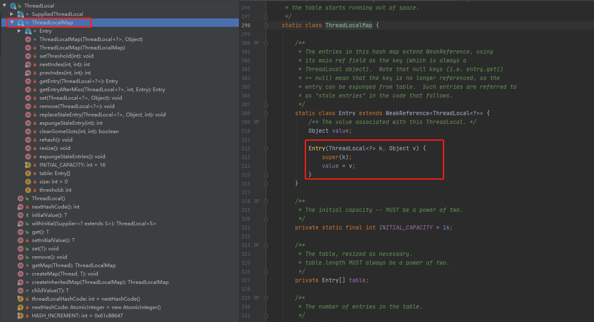
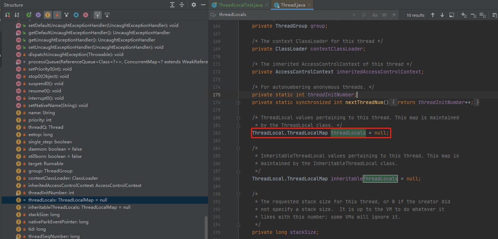
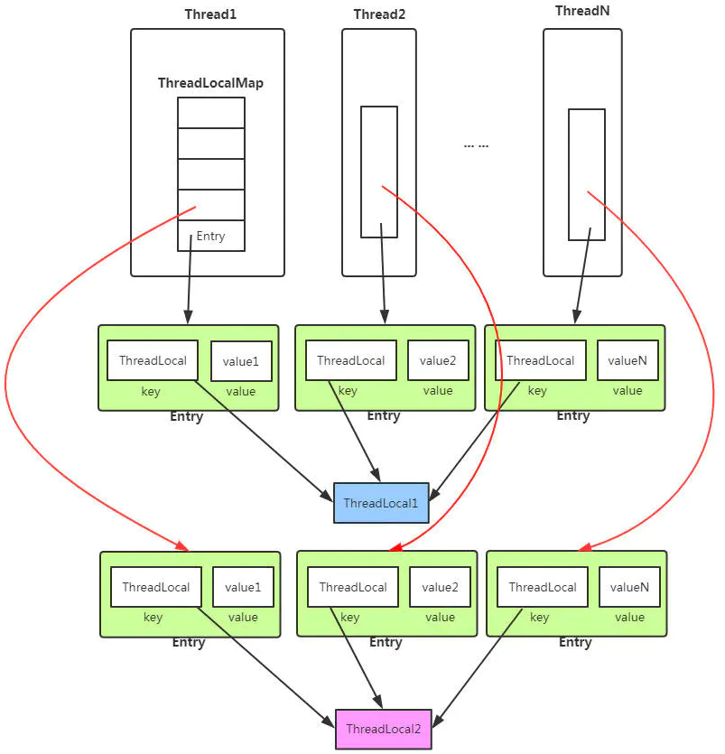
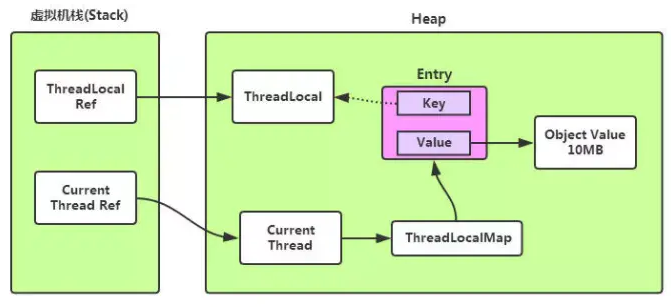
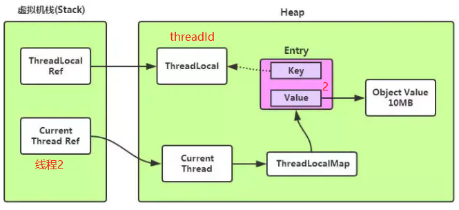

## ThreadLocal是什么
ThreadLocal是JAVA线程安全提供的一个工具类，用来存放线程的局部变量，使用他可以为每个线程创建一个副本，线程间可以独立改变自己线程的这个这个变量而不影响其他线程，相对于使用加锁会会导致线程阻塞从而影响性能，ThreadLocal采用了一种"以空间换时间"的方式来达到线程的安全。
<!--more-->
```java
import org.junit.Test;
import java.util.concurrent.TimeUnit;
import java.util.concurrent.atomic.AtomicInteger;
public class ThreadLocalTest {
    private static final AtomicInteger nextId = new AtomicInteger(0);
    private static final ThreadLocal<Integer> threadId = new ThreadLocal<Integer>(){
        @Override
        protected Integer initialValue() {
            return nextId.getAndIncrement();
        }
    };
    @Test
    public void test1() throws InterruptedException {
        for(int i = 0 ; i < 5 ; i++){
            new Thread(new Runnable() {
                @Override
                public void run() {
                    System.out.println("threadName=" + Thread.currentThread().getName() + ",threadId=" + threadId.get());
                }
            },"线程" + i).start();
        }
        TimeUnit.SECONDS.sleep(2);
    }
}
//结果
threadName=Thread-1,threadId=0
threadName=Thread-0,threadId=1
threadName=Thread-2,threadId=2
threadName=Thread-3,threadId=3
threadName=Thread-4,threadId=4
```

## ThreadLocal结构

为什么ThreadLocal能做到每个线程一个副本并且之间不会相互影响呢。我们来看下ThreadLocal结构。





从代码上我们可以知道

- ThreadLocal类中定义着一个ThreadLocalMap内部类，ThreadLocalMap的key为ThreadLocal对象，值为Object。
- Thread类中维护这个一个变量threadLocals，类型是ThreadLocal.ThreadLocalMap。
- <font color=red>我们说的副本是存在在Thread类的，而不是ThreadLocal，ThreadLocal只是可以获取到各个线程的这个副本。</font>

到这里我们大概能知道为什么ThreadLocal能做到每个线程一个变量互补干扰。因为Thread类维护这一个局部变量threadLocals，这样相当于每个线程有自己的一份数据，而ThreadLocal通过获取每个线程的这个局部变量进行操作，所以是互不干扰的。



- 每一个线程都维护这一个ThreadLocalMap的数组，这个就是实现线程之间互不影响的原因，因为每个线程自己维护了一个Entry
- ThreadLocal只是用来管理每个线程中Entry的一个工具，因为真正的ThreadLocalMap是定义在每一个线程中
- **为啥是一个Entry数组？**因为可能你定义了多个ThreadLocal变量，每个ThreadLocal指向一个Entry,这样不同的ThreadLocal可以操作不同的数据。

## ThreadLocal内存泄露问题

我们先提出几个问题：
- 为什么ThreadLocalMap中的Entry要用弱引用?
- 引起ThreadLocal内存泄露的原因是什么，是因为弱引用吗?

弱引用指的是如果一个对象没有强引用链可达，那么一般活不过下一次GC。在ThreadLocal.ThreadLocalMap中的节点Entry使用了弱引用。
```java
static class Entry extends WeakReference<ThreadLocal<?>> {
    /** The value associated with this ThreadLocal. */
    Object value;

    Entry(ThreadLocal<?> k, Object v) {
        super(k);
        value = v;
    }
}
```


从图上可以看出，虚线指得是弱引用。我们结合本文前面的代码来进行分析。假设下图是线程2的现在的内存结构。可以看出线程2中的局部变量ThreadLocalMap中有一个Entry,key为threadId，值为2。key是弱引用，当threadId=null时，key会在下一次GC时被清除。

**为什么ThreadLocalMap中的Entry要用弱引用？**
如果是强引用的话，在线程运行过程中，如果我们设置了threadId=null，按道理来说相当于ThreadLocalRef->ThreadLocal这条线断了，threadId应该被回收，但是看图我们知道key->ThreadLocal还存在着导致ThreadLocal没法被回收。所以在key->ThreadLocal使用了弱引用。当ThreadLocal没有被其他强引用时，在下一次GC时，ThreadLocal会被回收，且key = null 也被回收。

**那引起内存泄露的是弱引用吗？**
显然不是，用了弱引用避免了threadId=null时，其实内部还被引用着导致实际上没被回收。

**引起内存泄露的真正原因是什么？**
上面说到当我们threadId=null时，ThreadLocal可以被回收了。这个时候就会出现Entry中Key已经被回收，出现一个null Key的情况，外部读取ThreadLocalMap中的元素是无法通过null Key来找到Value的。因此如果当前线程的生命周期很长，一直存在，那么其内部的ThreadLocalMap对象也一直生存下来，这些null key就存在一条强引用链的关系一直存在：Thread --> ThreadLocalMap-->Entry-->Value，这条强引用链会导致Entry不会回收，Value也不会回收，但Entry中的Key却已经被回收的情况，造成内存泄漏。<font color=red>所以说，真正造成内存泄露的原因是由于当线程的生命周期很长时，Value没法通过ThreadLocal的remove来清理，或者说没清理导致一直占用内存导致的。</font>

**如何避免内存泄露?**
通过上面分析我们知道了内存泄露的原因，在使用上我们也要注意
- 每次用完ThreadLocal时要记得调用<font color=red>remove方法</font>清理防止内存泄露。
- 如果线程生命周期很长，在使用完Value时要先调用<font color=red>remove方法</font>清理，防止线程生命过期过长导致Value一直占用内存。

## ThreadLocal源码分析

### set方法

```java
public void set(T value) {
    //获取当前调用set的线程
    Thread t = Thread.currentThread();
    //获取当前线程的threadLocals变量
    ThreadLocalMap map = getMap(t);
    if (map != null)
        //如果threadLocals已经初始化则直接赋值，this是当前的ThreadLocal
        map.set(this, value);
    else
        //初始化t.threadLocals
        createMap(t, value);
}

ThreadLocalMap getMap(Thread t) {
    return t.threadLocals;
}

void createMap(Thread t, T firstValue) {
    //初始化ThreadLocalMap并设值。 这个ThreadLocalMap是整个ThreadLocal的重点，后面分析
    t.threadLocals = new ThreadLocalMap(this, firstValue);
}
```

### get方法

```java
public T get() {
    Thread t = Thread.currentThread();
    ThreadLocalMap map = getMap(t);
    if (map != null) {
        //从ThreadLocalMap中获取当前线程ThreadLocalMap下，key = 当前ThreadLocal的值
        ThreadLocalMap.Entry e = map.getEntry(this);
        if (e != null) {
            @SuppressWarnings("unchecked")
            T result = (T)e.value;
            return result;
        }
    }
    //初始化t.threadLocals并设值
    return setInitialValue();
}

//初始化
private T setInitialValue() {
    //initialValue这个方法是子类需要重写的方法，用来设定初始的value
    T value = initialValue();
    Thread t = Thread.currentThread();
    ThreadLocalMap map = getMap(t);
    if (map != null)
        map.set(this, value);
    else
        createMap(t, value);
    return value;
}
```

### remove方法

```java
public void remove() {
    //调用ThreadLocalMap的remove方法删除值
    ThreadLocalMap m = getMap(Thread.currentThread());
    if (m != null)
        m.remove(this);
}
```


## ThreadLocalMap源码分析(重点)

ThreadLocal方法都是调用ThreadLocalMap方法实现的。ThreadLocalMap才是ThreadLocal的重点。

ThreadLocalMap结构上有点类似HashMap，但也有不同的地方。

### 数据结构和成员变量

```java
//Entry是TheadLocalMap的节点结构，类似与HashMap中的Node
//key是ThreadLocal且是弱引用
static class Entry extends WeakReference<ThreadLocal<?>> {
    Object value;
    Entry(ThreadLocal<?> k, Object v) {
        super(k);
        value = v;
    }
}
//初始容量，必须为2的幂
private static final int INITIAL_CAPACITY = 16;
//Entry表，大小必须为2的幂 在ThreadLocalMap中，table其实是一个环形数组
private Entry[] table;	
//表里entry的个数
private int size = 0;
//重新分配表大小的阈值，默认为0
private int threshold;
```

<font color=red>**由于ThreadLocalMap使用线性探测法来解决散列冲突，所以实际上Entry[]数组在程序逻辑上是作为一个环形存在的。**</font>

![Entry[]数组](threadlocal/6.png)

ThreadLocalMap维护了Entry环形数组，数组中元素Entry的逻辑上的key为某个ThreadLocal对象（实际上是指向该ThreadLocal对象的弱引用），value为代码中该线程往该ThreadLoacl变量实际塞入的值。

### 构造方法

```java
ThreadLocalMap(ThreadLocal<?> firstKey, Object firstValue) {
    //初始化table,容量是16
    table = new Entry[INITIAL_CAPACITY];
    //到对应的数组下标
    int i = firstKey.threadLocalHashCode & (INITIAL_CAPACITY - 1);
    //赋值
    table[i] = new Entry(firstKey, firstValue);
    size = 1;
    //设置重新分配表大小的阈值
    setThreshold(INITIAL_CAPACITY);
}
private void setThreshold(int len) {
   threshold = len * 2 / 3;
}
```

**ThreadLocal.threadLocalHashCode取值**

```java
private static AtomicInteger nextHashCode = new AtomicInteger();

private final int threadLocalHashCode = nextHashCode();
//定义魔数
private static final int HASH_INCREMENT = 0x61c88647;
//每次创建一个ThreadLocal时，都在nextHashCode基础上加一个HASH_INCREMENT
private static int nextHashCode() {
    return nextHashCode.getAndAdd(HASH_INCREMENT);
}
```

可以看到，每当创建 `ThreadLocal` 实例时这个值都会`getAndAdd(0x61c88647)`作为ThreadLocal的哈希值。<font color=red>通过理论与实践，当我们用0x61c88647作为魔数累加为每个ThreadLocal分配各自的ID也就是threadLocalHashCode再与2的幂取模，得到的结果分布很均匀</font>。

### set()方法

```java
private void set(ThreadLocal<?> key, Object value) {
    Entry[] tab = table;
    int len = tab.length;
    //通过hash * (table.length - 1) 路由寻址到下标
    int i = key.threadLocalHashCode & (len-1);
    //nextIndex采用线性探测的方式
    //因为ThreadLocal在hash冲突的时候是采用线性探测的方式，例如这个下标被占了，就找往后的一个位置看看有没有被占
    for (Entry e = tab[i]; e != null ; e = tab[i = nextIndex(i, len)]) {
        ThreadLocal<?> k = e.get();
        //如果下标i对应的ThreadLocal跟我传进来的ThraedLocal一致，那就做赋值操作。
        if (k == key) {
            e.value = value;
            return;
        }
        //k == null表示原来的ThreadLocal已经被清理了，这里重新设置新的ThreadLocal到这个数组下标并会尽可能清理无效slot
        if (k == null) {
            replaceStaleEntry(key, value, i);
            return;
        }
        //继续循环表示哈希与冲突，获取下一个的数组下标继续查询
    }
    tab[i] = new Entry(key, value);
    int sz = ++size;
    if (!cleanSomeSlots(i, sz) && sz >= threshold)
        rehash();
}

private static int nextIndex(int i, int len) {
   return ((i + 1 < len) ? i + 1 : 0);
}
```

## 参考

- https://www.cnblogs.com/micrari/p/6790229.html