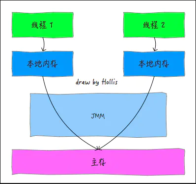
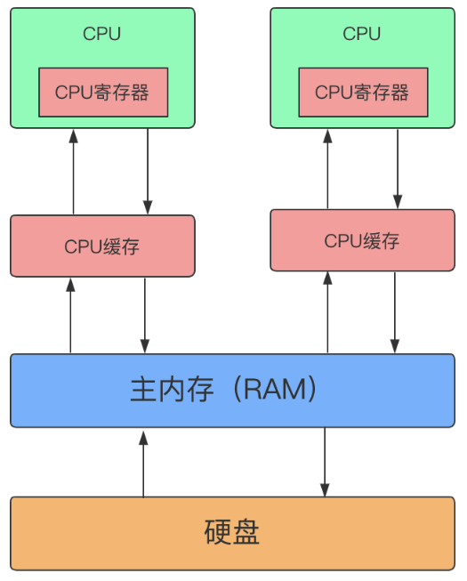

## Java内存模型(jmm)
看个例子
```java
public class VolatileExample extends Thread{
    //设置类静态变量,各线程访问这同一共享变量
    private  static boolean flag = false;
    //无限循环,等待flag变为true时才跳出循环
   public void run() {
       while (!flag){
       };
       System.out.println("停止了");
   }

    public static void main(String[] args) throws Exception {
        new VolatileExample().start();
        //sleep的目的是等待线程启动完毕,也就是说进入run的无限循环体了
        Thread.sleep(100);
        flag = true;
    }
}
```
上面程序运行后发现当主线程设置flag为true时子线程的循环并没有停掉。
<!--more-->
***为什么会出现上面的问题?***

Java内存模型规定所有的变量都是存在主存当中（类似于前面说的物理内存），每个线程都有自己的工作内存（类似于前面的高速缓存）。线程对变量的所有操作都必须在工作内存中进行，而不能直接对主存进行操作。并且每个线程不能访问其他线程的工作内存。如下图


所以根据JMM规范，每个线程都有单独的一个工作内存，当主线程在运行时会将flag变量的值拷贝一份到自己的工作内存中，当改变了flag时但是还没来得及写入主存中，主线程转去做其他事情，那么子线程就不知道flag的更改，所以就一直循环下去。

## volatile详解
### 线程中的三个概念
- 原子性，对基本数据类型的变量的读取和赋值操作是原子性操作，即这些操作是不可被中断的，要么执行，要么不执行
- 可见性，保证修改的值会立即被更新到主存，当有其他线程需要读取时，它会去内存中读取新值
- 有序性，在Java内存模型中，允许编译器和处理器对指令进行重排序，但是重排序过程不会影响到单线程程序的执行

### volatile作用
一旦一个共享变量（类的成员变量、类的静态成员变量）被volatile修饰之后，那么就具备了两层语义：
- 保证了不同线程对volatile修饰的变量进行改动时，其他线程能马上可见
- 禁止执行重排序

### volatile如何保证可见性

https://www.toutiao.com/a6845877313154843148/

出现上面的问题的原因在硬件层面是由于**CPU缓存的问题**。



由于内存的速度跟不上CPU的运算，所以加入了CPU高速缓存，也也就导致了上面的问题，CPU0修改的数据存在CPU0上的缓存没来得及写入到主内存，导致CPU1没获取到最近的修改值。CPU为了解决这个问题使用了**MESI缓存一致性协议**（<font color=red>多个CPU从主内存读取同一个数据到各自的高速缓存，当其中某个CPU修改了缓存里的数据，该数据会马上同步回主内存，其他CPU通过总线嗅探机制可以感知到数据的变化从而将自己缓存里的数据失效</font>）。

**缓存一致性原理协议(MESI)**

当CPU写数据时，如果发现操作的变量是共享变量，即在其他CPU中也存在该变量的副本，会发出信号通知其他CPU将该变量的缓存行置为无效状态，因此当其他CPU需要读取这个变量时， 发现自己缓存中缓存该变量的缓存行是无效的，那么它就会从内存重新读。

volatile关键字在汇编底层的<font color=red>实现原理就是通过汇编lock前缀指令</font>。

```
0x000000010d3f3203: lock addl $0x0,(%rsp)     ;*putstatic flag
; - com.java.study.VolatileStudy::lambda$main$1@9 (line 31)
```

lock前缀指令实现了如下效果：

- 它会强制将对缓存的修改操作立即写入主存。
- 如果是写操作，它会导致其他CPU中对应的缓存行无效。

综合上面两条实现原则，我们了解到：**如果一个变量被volatile所修饰的话，在每次数据变化之后，其值都会被强制刷入主存。而其他处理器的缓存由于遵守了缓存一致性协议，也会把这个变量的值从主存加载到自己的缓存中。这就保证了一个volatile在并发编程中，其值在多个缓存中是可见的**。

### volatile支持有序性
volatile有序性的保证就是通过禁止指令重排序来实现的。在执行程序时，为了提高性能，编译器和处理器会对指令做重排序。原理还是通过<font color=red>lock前缀指令</font>。lock前缀指令实际上相当于一个内存屏障。除了上面的两个效果，还有下面这个效果。

- 它确保指令重排序时不会把其后面的指令排到内存屏障之前的位置，也不会把前面的指令排到内存屏障的后面；即在执行到内存屏障这句指令时，在它前面的操作已经全部完成。

虚拟机在执行程序时，如果两个操作的执行次序无法从happens-before原则推导出来，那么它们就不能保证它们的有序性，虚拟机可以随意地对它们进行重排序，举个例子。

```
x = 1; //1
y = 10; //2
c = x + y; //3
```
由于1,2操作上前后没有关系，虚拟机可以对他们进行重排序，但是3一定在1,2后面，这是根据happens-before规则来规范的。
**那volatile修饰的变量保证有序性是如何理解呢?**
```
x = 2;        //语句1
y = 0;        //语句2
flag = true;  //语句3 flag为volatile变量
x = 4;         //语句4
y = -1;       //语句5
```
由于flag变量为volatile变量，那么在进行指令重排序的过程的时候，不会将语句3放到语句1、语句2前面，也不会讲语句3放到语句4、语句5后面。但是要注意语句1和语句2的顺序、语句4和语句5的顺序是不作任何保证的

那么禁止指令重排序又是如何实现的呢？答案是<font color=red>加内存屏障</font>。JMM为volatile加内存屏障有以下4种情况：JMM为volatile加内存屏障有以下4种情况：

- 在每个volatile写操作的前面插入一个StoreStore屏障，防止写volatile与后面的写操作重排序。
- 在每个volatile写操作的后面插入一个StoreLoad屏障，防止写volatile与后面的读操作重排序。
- 在每个volatile读操作的后面插入一个LoadLoad屏障，防止读volatile与后面的读操作重排序。
- 在每个volatile读操作的后面插入一个LoadStore屏障，防止读volatile与后面的写操作重排序。

### volatile不支持原子性

首先先理解原子性的概念，它指的是在**一个操作过程**中是不可分的，要嘛成功要嘛失败,主体是一个操作过程，一个操作过程是可以包含多条操作语句的，但是volatile只能保证一个变量的可见性和有序性。
```
volatile int i = 5;
temp = i + 1;
i = temp;
```
假设上面一个操作过程，i使用了volatile修饰，首先AB两个线程同时读取到i = 5，然后A执行了 temp = i + 1; 此时temp变成了6，此时 i 还是5。这时B也执行到了temp = i + 1; temp = 6,然后AB接下去执行i = temp时，就有一个线程少+1了。

## java中使用volatile
### 单例模式的双检查锁
```
public class SingletonFour {
    private static volatile SingletonFour singletonFour;
    private SingletonFour(){}
    private static SingletonFour getSingleton(){
        if(singletonFour == null){  //第一次检查
            synchronized (SingletonFour.class){
                if(singletonFour == null) //第二次检查
                    singletonFour = new SingletonFour(); // 标注1
            }
        }
        return singletonFour;
    }
}
```
这里单例使用了volatile修饰，原因是标注1会发生重排序另一个并发执行的线程B就有可能在判断instance不为null时，线程B接下来将访问instance所引用的对象，但此时这个对象可能还没有被A线程初始化。
这里说一下 new Object()背后的指令 例如 Cache cache=new Cache()
```
	// 创建 Cache 对象实例，分配内存
       0: new           #5                  // class com/query/Cache
       // 复制栈顶地址，并再将其压入栈顶
       3: dup
	// 调用构造器方法，初始化 Cache 对象
       4: invokespecial #6                  // Method "<init>":()V
	// 存入局部方法变量表
       7: astore_1
```
从字节码可以看到创建一个对象实例，可以分为三步
1. 分配对象内存
2. 调用构造器方法，执行初始化
3. 将对象引用赋值给变量

虚拟机实际运行时，以上指令可能发生重排序。以上代码 2,3 可能发生重排序，但是并不会重排序 1 的顺序。也就是说 1 这个指令都需要先执行，因为 2,3 指令需要依托 1 指令执行结果。所以用volatile修饰可以保证有序性
### happens-before

happens-before是JMM用来阐述多线程直接有序性的原则。在Java内存模型中，如果要确保有序性可以靠volatile和synchronized来实现，但是如果所有的有序性都仅仅依靠这两个关键字来完成，那么有一些操作将会变得很繁琐，但是我们在编写Java代码的时候并没有感觉到这一点，这是因为Java语言中有一个“先行发生(happens-before)”的原则。

happends-before可以翻译成：<font color=red>前一个操作的结果可以被后续的操作获取。</font>讲白点就是前面一个操作把变量a赋值成1，那后面一个操作肯定能知道a已经变成1了。

1. 程序次序规则：一个线程内，按照代码顺序，书写在前面的操作先行发生于书写在后面的操作；
2. 锁定规则：一个unLock操作先行发生于后面对同一个锁的lock操作；
3. volatile变量规则：对一个变量的写操作先行发生于后面对这个变量的读操作；
4. 传递规则：如果操作A先行发生于操作B，而操作B又先行发生于操作C，则可以得出操作A先行发生于操作C；
5. 线程启动规则：Thread对象的start()方法先行发生于此线程的每个一个动作；
6. 线程中断规则：对线程interrupt()方法的调用先行发生于被中断线程的代码检测到中断事件的发生；
7. 线程终结规则：线程中所有的操作都先行发生于线程的终止检测，我们可以通过Thread.join()方法结束、Thread.isAlive()的返回值手段检测到线程已经终止执行；
8. 对象终结规则：一个对象的初始化完成先行发生于他的finalize()方法的开始

### as-if-serial语义

as-if-serial语义的意思是：**不管怎么重排序（编译器和处理器为了提供并行度），（单线程）程序的执行结果不能被改变。**as-if-serial语义使程序员不必担心单线程中重排序的问题干扰他们。

## 总结

- volatile保证了线程的可见性，当一个线程对其修饰volatile的变量进行改动时会立即被更新到主存
- volatile保证了线程的有序性
- volatile不能保证原子性

## 参考

- https://www.toutiao.com/a6839502799437300237/
  - https://baijiahao.baidu.com/s?id=1709086005694976168&wfr=spider&for=pc	