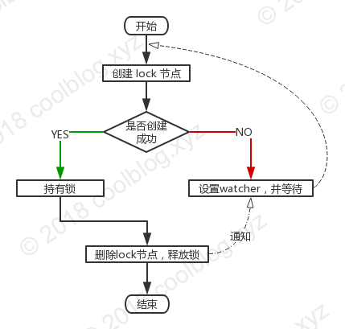
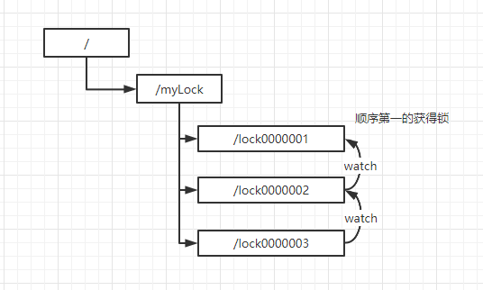
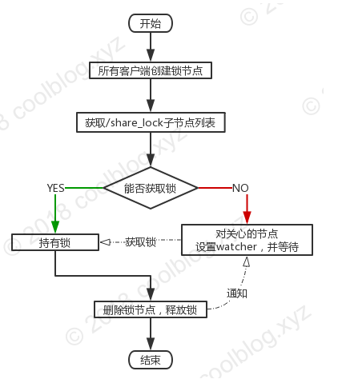

<!--more-->


## 什么是分布式锁

在日常开发中，我们最熟悉也常用的分布式锁场景是在开发多线程的时候。为了协调本地应用上多个线程对某一资源的访问，就要对该资源或数值变量进行加锁，以保证在多线程环境下系统能够正确地运行。在一台服务器上的程序内部，线程可以通过系统进行线程之间的通信，实现加锁等操作。而在分布式环境下，执行事务的线程存在于不同的网络服务器中，要想实现在分布式网络下的线程协同操作，就要用到分布式锁。

## 独占式非公平分布式锁

### 概述

独占式非公平锁采用的方式是通过创建节点，如果节点创建成功则表示加锁成功，如果创建不成功则需要等待并对节点(锁)设置watch。

当节点(锁)释放后会触发watch的节点删除事件，从而重新抢占创建节点。


<!--more-->
1. 多个客户端竞争创建 lock 临时节点
2. 其中某个客户端成功创建 lock 节点，其他客户端对 lock 节点设置 watcher
3. 持有锁的客户端删除 lock 节点或该客户端崩溃，由 Zookeeper 删除 lock 节点
4. 其他客户端获得 lock 节点被删除的通知
5. 重复上述4个步骤，直至无客户端在等待获取锁了

### 代码实例

**主代码**

```java
package lock;

import org.apache.commons.lang3.StringUtils;
import org.apache.curator.RetryPolicy;
import org.apache.curator.framework.CuratorFramework;
import org.apache.curator.framework.CuratorFrameworkFactory;
import org.apache.curator.framework.recipes.cache.ChildData;
import org.apache.curator.framework.recipes.cache.NodeCache;
import org.apache.curator.framework.recipes.cache.NodeCacheListener;
import org.apache.curator.framework.state.ConnectionState;
import org.apache.curator.framework.state.ConnectionStateListener;
import org.apache.curator.retry.ExponentialBackoffRetry;
import org.apache.curator.utils.CloseableUtils;
import org.apache.zookeeper.CreateMode;
import org.apache.zookeeper.KeeperException;

import java.util.UUID;
import java.util.concurrent.CountDownLatch;
import java.util.concurrent.TimeUnit;

/***
 * 使用zk实现分布式独占锁
 */
public class ZkOnlyLock {
    private static String lockNameSpace = "/mylock";
    public static String CONNECT_ADDR = "localhost:2181";
    private static final ThreadLocal<String> threadUuid = new ThreadLocal<String>() {
        @Override
        protected String initialValue() {
            return UUID.randomUUID().toString();
        }
    };
    private CuratorFramework cf;
    private String locakPath;

    /***
     *
     * @param lockPath 锁路径
     */
    public ZkOnlyLock(String lockPath) {
        this.locakPath = lockNameSpace + "/" + lockPath;
        RetryPolicy retryPolicy = new ExponentialBackoffRetry(1000, 3);
        cf = CuratorFrameworkFactory.builder()
                .connectString(CONNECT_ADDR)
                .sessionTimeoutMs(5000)
                .connectionTimeoutMs(5000)
                .retryPolicy(retryPolicy)
                .build();
        cf.getConnectionStateListenable().addListener(new ConnectionStateListener() {
            @Override
            public void stateChanged(CuratorFramework curatorFramework, ConnectionState connectionState) {
                if (connectionState == ConnectionState.LOST) {
                    System.out.println("连接丢失");//连接丢失
                } else if (connectionState == ConnectionState.CONNECTED) {
                    System.out.println("成功连接");
                } else if (connectionState == ConnectionState.RECONNECTED) {
                    System.out.println("重连成功");
                }
            }
        });
        cf.start();
    }

    public void lock() {
        this.lock(0, null);
    }
	
    public void lock(long millisToWait, TimeUnit unit) {
        boolean doDeleteOurPath = false;
        for (;doDeleteOurPath == false;) {
            try {
                String path = cf.create()
                        .creatingParentsIfNeeded() //自动创建父节点
                        .withMode(CreateMode.PERSISTENT)
                        .forPath(locakPath, threadUuid.get().getBytes());
                if (StringUtils.isNoneBlank(path)) {
                    System.out.println("线程" + Thread.currentThread().getId() + "获得锁");
                    break;
                }
            } catch (Exception e) {
                if (e instanceof KeeperException.NodeExistsException) {
                    //如果是已经存在节点了，则设置watch并阻塞
                    NodeCache cache = new NodeCache(cf, locakPath);
                    CountDownLatch countDownLatch = new CountDownLatch(1);
                    cache.getListenable().addListener(new NodeCacheListener() {
                        @Override
                        public void nodeChanged() throws Exception {
                            ChildData childData = cache.getCurrentData();
                            if (childData == null) {
                                System.out.println("===节点被删除，可以开始尝试创建===");
                                countDownLatch.countDown();
                            }
                        }
                    });
                    try {
                        cache.start();
                    } catch (Exception exception) {
                        exception.printStackTrace();
                    }
                    try {
                        if (unit != null) {
                            countDownLatch.await(millisToWait, unit);
                            doDeleteOurPath = true;
                        } else {
                            countDownLatch.await();
                        }
                        CloseableUtils.closeQuietly(cache);
                    } catch (InterruptedException interruptedException) {
                        interruptedException.printStackTrace();
                    }
                }
            }
        }
    }

    /***
     * 解锁
     */
    public void unlock() {
        try {
            String uuidData = new String(cf.getData().forPath(locakPath), "UTF-8");
            //如果存的是同一个uuid则进行删除，否则不是自己加锁的
            if (StringUtils.isNoneBlank(uuidData) && uuidData.equals(threadUuid.get())) {
                cf.delete().forPath(locakPath);
            }
        } catch (Exception e) {
            e.printStackTrace();
        } finally {
            threadUuid.remove();
        }
    }
}
```

**测试代码**

```java
/****
     * 测试加锁
     */
    @Test
    public void onlyLockTest1() {
        ZkOnlyLock zkOnlyLock = new ZkOnlyLock("lock001");
        ExecutorService executorService = Executors.newFixedThreadPool(100);
        for (int i = 0; i < 5; i++) {
            executorService.execute(() -> {
                try {
                    zkOnlyLock.lock();
                    System.out.println("做事ing");
                    try {
                        TimeUnit.SECONDS.sleep(5);
                    } catch (InterruptedException e) {
                        e.printStackTrace();
                    }
                } finally {
                    zkOnlyLock.unlock();
                }
            });
        }
    }

    /***
     * 测试超时
     * @throws InterruptedException
     */
    @Test
    public void onlyLockTest2() throws InterruptedException {
        ZkOnlyLock zkOnlyLock = new ZkOnlyLock("lock001");
        Thread thread = new Thread(new Runnable() {
            @Override
            public void run() {
                try {
                    TimeUnit.SECONDS.sleep(1);
                } catch (InterruptedException e) {
                    e.printStackTrace();
                }
                zkOnlyLock.lock(10,TimeUnit.SECONDS);
                System.out.println("====do=====");
                zkOnlyLock.unlock();
            }
        });
        thread.start();
        zkOnlyLock.lock();
        TimeUnit.SECONDS.sleep(30);
        zkOnlyLock.unlock();
        thread.join();
    }
```

### 缺点

这种方式的锁达不到公平的效果，每次一个锁释放后其他的锁就会同时触发watch。造成同一时间点多次请求Zookeeper。有性能问题。

## 独占式公平分布式锁

### 概述





1. 所有客户端创建自己的锁节点(临时顺序节点)
2. 从 Zookeeper 端获取 /share_lock下所有的子节点
3. 判断自己创建的锁节点是否可以获取锁(如果是第一个就是可以获取到锁)，如果可以，持有锁。否则对自己上一个节点设置watcher
4. 持有锁的客户端删除自己的锁节点，某个客户端收到该节点被删除的通知，并获取锁
5. 重复步骤4，直至无客户端在等待获取锁了

### 代码实例

```java
package lock;

import com.google.common.collect.Lists;
import org.apache.commons.lang3.StringUtils;
import org.apache.curator.RetryPolicy;
import org.apache.curator.framework.CuratorFramework;
import org.apache.curator.framework.CuratorFrameworkFactory;
import org.apache.curator.framework.recipes.cache.ChildData;
import org.apache.curator.framework.recipes.cache.NodeCache;
import org.apache.curator.framework.recipes.cache.NodeCacheListener;
import org.apache.curator.framework.state.ConnectionState;
import org.apache.curator.framework.state.ConnectionStateListener;
import org.apache.curator.retry.ExponentialBackoffRetry;
import org.apache.curator.utils.CloseableUtils;
import org.apache.zookeeper.CreateMode;
import org.apache.zookeeper.data.Stat;

import java.util.List;
import java.util.concurrent.CountDownLatch;
import java.util.concurrent.TimeUnit;
import java.util.stream.Collectors;

/***
 * 分布式共享锁
 */
public class ZkOnlyFairLock {
    private static String lockNameSpace = "/mylock02";
    public static String CONNECT_ADDR = "localhost:2181";
    private CuratorFramework cf;
    private String locakPath;
    private String currentLockPath;

    /***
     *
     * @param lockPath 锁路径
     */
    public ZkOnlyFairLock(String lockPath) {
        this.locakPath = lockNameSpace + "/" + lockPath;
        RetryPolicy retryPolicy = new ExponentialBackoffRetry(1000000, 3);
        cf = CuratorFrameworkFactory.builder()
                .connectString(CONNECT_ADDR)
                .sessionTimeoutMs(5000)
                .connectionTimeoutMs(5000)
                .retryPolicy(retryPolicy)
                .build();
        cf.getConnectionStateListenable().addListener(new ConnectionStateListener() {
            @Override
            public void stateChanged(CuratorFramework curatorFramework, ConnectionState connectionState) {
                if (connectionState == ConnectionState.LOST) {
                    System.out.println("连接丢失");//连接丢失
                } else if (connectionState == ConnectionState.CONNECTED) {
                    System.out.println("成功连接");
                } else if (connectionState == ConnectionState.RECONNECTED) {
                    System.out.println("重连成功");
                }
            }
        });
        cf.start();
    }

    /***
     * 设置watch+等待锁
     * @param millisToWait
     * @param unit
     * @param path
     * @return
     * @throws Exception
     */
    public boolean waiteLock(long millisToWait, TimeUnit unit, String path) {
        boolean haveTheLock = false;
        boolean doDeleteOurPath = false;
        try {

            while (!haveTheLock) {
                List<String> childNodeList = getChildrenPath();//获取到所有的节点 [lock0000000005, lock0000000006, lock0000000007]
                String pathName = path.substring(lockNameSpace.length() + 1);
                int nodeIndex = childNodeList.indexOf(pathName);
                if (nodeIndex < 0) {
                    //节点不存在，抛出异常
                    throw new RuntimeException("顺序节点不存在");
                }

                if (nodeIndex == 0) {
                    haveTheLock = true; //获得锁
                    System.out.println("path = " + path + " 获得锁");
                } else {
                    //如果不是第一个节点则对上一个节点做监听
                    String preNodePath = lockNameSpace.concat("/").concat(childNodeList.get(nodeIndex - 1));
                    CountDownLatch countDownLatch = new CountDownLatch(1);
                    //可能对上一个节点做监听时，这个节点已经被删除了
                    NodeCache cache = new NodeCache(cf, preNodePath);
                    //对上一个节点做监听
                    cache.getListenable().addListener(new NodeCacheListener() {
                        @Override
                        public void nodeChanged() throws Exception {
                            ChildData childData = cache.getCurrentData();
                            if (childData == null) {
                                countDownLatch.countDown();
                            }
                        }
                    });
                    cache.start();
                    //再次判断下上个节点存不存在，如何存在才阻塞，防止出现节点删除后才建立监控导致一直阻塞
                    if (isExistNode(preNodePath)) {
                        System.out.println("====对path=" + preNodePath + " 设置watch监听，并开始阻塞 -" + path);
                        countDownLatch.await();
                    } else {
                        CloseableUtils.closeQuietly(cache);
                    }
                }
            }
        } catch (Exception e) {
            //异常了要删除原来的节点
            doDeleteOurPath = true;
        } finally {
            if (doDeleteOurPath) {
                deleteNode(path);
            }
        }
        return haveTheLock;
    }

    public void lock() throws Exception {
        this.lock(0, null);
    }

    /***
     * 加锁
     */
    public void lock(long millisToWait, TimeUnit unit) throws Exception {
        boolean isDone = false;
        //加锁重试次数
        while (!isDone) {
            String path = createNode(); //创建顺序临时节点 path = /mylock02/lock0000000005
            this.currentLockPath = path; //记录当前的锁节点，后面解锁要用的
            if (StringUtils.isBlank(path)) {
                throw new RuntimeException("创建顺序节点失败");
            }
            if (waiteLock(millisToWait, unit, path)) {
                isDone = true;
            }
        }
    }

    /***
     * 解锁
     */
    public void unlock() {
        deleteNode(this.currentLockPath);
        CloseableUtils.closeQuietly(cf);
    }

    /***
     * 创建顺序临时节点
     * @return
     * @throws Exception
     */
    public String createNode() {
        String s = null;
        try {
            s = cf.create()
                    .creatingParentsIfNeeded() //自动创建父节点
                    .withMode(CreateMode.EPHEMERAL_SEQUENTIAL)
                    .forPath(locakPath);
        } catch (Exception e) {
            e.printStackTrace();
        }
        return s;
    }

    /***
     * 删除节点
     * @param path
     */
    public void deleteNode(String path) {
        try {
            if (isExistNode(path)) {
                cf.delete().forPath(path);
                System.out.println("====" + path + " 删除成功");
            }
        } catch (Exception e) {
            e.printStackTrace();
        }
    }

    /***
     * 判断节点是否存在
     * @param path
     * @return
     */
    public boolean isExistNode(String path) {
        try {
            Stat stat = cf.checkExists().forPath(path);
            return stat == null ? false : true;
        } catch (Exception e) {
            e.printStackTrace();
        }
        return false;
    }

    /***
     * 获取子节点并排序
     * @return
     */
    public List<String> getChildrenPath() {
        try {
            List<String> strings = cf.getChildren().forPath(lockNameSpace);
            return strings.stream().sorted().collect(Collectors.toList());
        } catch (Exception e) {
            e.printStackTrace();
            return Lists.newArrayList();
        }
    }

}

```

**测试代码**

```java
@Test
    public void zkOnlyFairLock01() throws InterruptedException {
        ExecutorService executorService = Executors.newFixedThreadPool(100);
        for(int i = 0 ; i < 100; i++){
            executorService.submit(() -> {
                ZkOnlyFairLock zkLock = new ZkOnlyFairLock("lock");
                try {
                    zkLock.lock();
                    System.out.println("做事ing");
                    TimeUnit.SECONDS.sleep(2);
                } catch (Exception e) {
                    e.printStackTrace();
                }finally {
                    zkLock.unlock();
                }
            });
        }
        executorService.awaitTermination(10,TimeUnit.MINUTES);
    }
```

## Curator提供的分布式锁

Curator是Zookeeper的一个工具类，他为我们提供了简便好用的分布式锁工具。

- InterProcessMutex：分布式可重入排它锁
- InterProcessSemaphoreMutex：分布式排它锁
- InterProcessReadWriteLock：分布式读写锁
- InterProcessMultiLock：将多个锁作为单个实体管理的容器

### 不可重入锁

InterProcessSemaphoreMutex是一种不可重入的互斥锁，也就意味着即使是同一个线程也无法在持有锁的情况下再次获得锁，所以需要注意，不可重入的锁很容易在一些情况导致死锁。

```java
@Test
public void curtorLock001() throws InterruptedException {
    ExecutorService executorService = Executors.newFixedThreadPool(100);
    for(int i = 0 ; i < 10; i++){
        executorService.submit(new Runnable() {
            @Override
            public void run() {
                CuratorFramework cf = CuratorFrameworkFactory.newClient("localhost:2181",new ExponentialBackoffRetry(2000,3));
                InterProcessLock lock = new InterProcessSemaphoreMutex(cf, "/curator/lock");
                try{
                    cf.start();
                    lock.acquire(); //只能调用一次，不可重入
                    System.out.println("做事ing");
                    TimeUnit.SECONDS.sleep(5);
                }catch (Exception e){
                    e.printStackTrace();
                }finally {
                    try {
                        lock.release();
                    } catch (Exception e) {
                        e.printStackTrace();
                    }
                }
            }
        });
    }
    executorService.awaitTermination(10,TimeUnit.MINUTES);
}
```

### 可重入锁

此锁可以重入，但是重入几次需要释放几次。

InterProcessMutex通过在zookeeper的某路径节点下创建临时序列节点来实现分布式锁，即每个线程（跨进程的线程）获取同一把锁前，都需要在同样的路径下创建一个节点，节点名字由uuid + 递增序列组成。而通过对比自身的序列数是否在所有子节点的第一位，来判断是否成功获取到了锁。当获取锁失败时，它会添加watcher来监听前一个节点的变动情况，然后进行等待状态。直到watcher的事件生效将自己唤醒，或者超时时间异常返回。

```java
@Test
public void curtorLock002() throws InterruptedException {
    ExecutorService executorService = Executors.newFixedThreadPool(100);
    for(int i = 0 ; i < 10; i++){
        executorService.submit(new Runnable() {
            @Override
            public void run() {
                CuratorFramework cf = CuratorFrameworkFactory.newClient("localhost:2181",new ExponentialBackoffRetry(2000,3));
                InterProcessLock lock = new InterProcessMutex(cf, "/curator/lock");
                try{
                    cf.start();
                    lock.acquire();
                    lock.acquire();
                    System.out.println("做事ing");
                    TimeUnit.SECONDS.sleep(5);
                }catch (Exception e){
                    e.printStackTrace();
                }finally {
                    try {
                        lock.release();
                        lock.release();
                    } catch (Exception e) {
                        e.printStackTrace();
                    }
                }
            }
        });
    }
    executorService.awaitTermination(10,TimeUnit.MINUTES);
}
```

### 可重入读写锁 

InterProcessReadWriteLock

### 多个锁

InterProcessMultiLock

## zk分布式锁优缺点

缺点：由于ZK是强一致性系统，对于写请求需要发送给leader同一协调，如果有较多的客户端频繁的申请加锁、释放锁，对于 ZK 集群的压力会比较大。

优点：

- 相对于Redis的实现方式，zk使用设置watch的方式，不会出现key过期导致业务还没执行完锁就自动失效的问题。
- 由于Redis不是强一致性系统，在极端情况下会出现（clientA获取锁后，主redis复制数据到从redis过程中崩溃了，导致没有复制到从redis中，然后从redis选举出一个升级为主redis,造成新的主redis没有clientA 设置的锁，这是clientB尝试获取锁，并且能够成功获取锁，导致互斥失效）的问题。zk是强一致性系统，每次写操作都需要先发给leader，leader处理写请求，一半以上的从节点也写成功，才返回给客户端成功。

## 参考

- https://www.jianshu.com/p/6e20e65f301a
- http://www.tianxiaobo.com/2018/01/20/%E5%9F%BA%E4%BA%8E-Zookeeper-%E7%9A%84%E5%88%86%E5%B8%83%E5%BC%8F%E9%94%81%E5%AE%9E%E7%8E%B0/
- https://www.jianshu.com/p/7fe495c93290