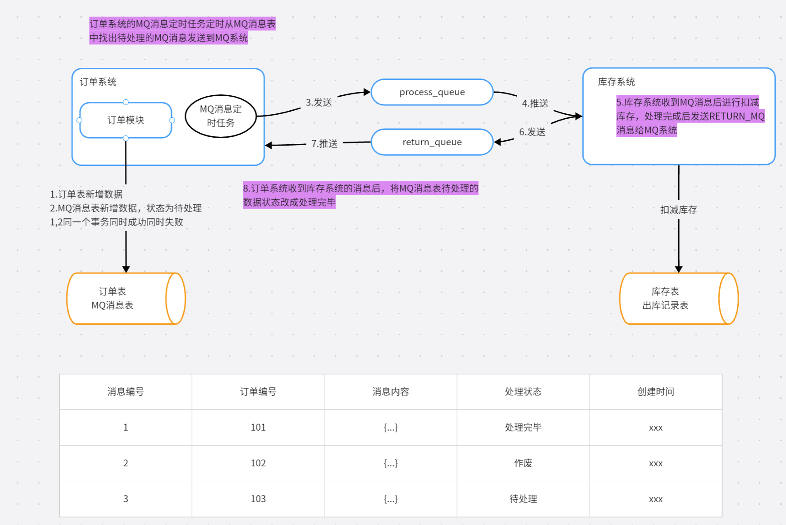
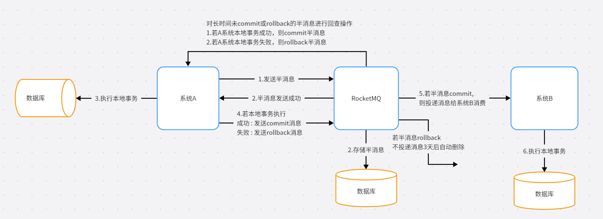

## 基于本地消息表分布式事务

### 基于本地消息表实现分布式事务的流程

- 订单表和MQ消息表新增数据在同一个事务内，同时成功同时失败，MQ消息状态为待处理。
- MQ定时任务程序定时找出待处理的MQ消息推送到MQ系统。
- 库存系统收到MQ系统推送的MQ消息后进行扣减库存，同时处理完后发送处理完成消息到MQ系统。
- 订单系统收到MQ系统推送的扣减库存成功消息后更新MQ消息状态为待处理。

### 基于本地消息表路程的情况分析

**订单表操作成功，MQ消息表操作失败**

这种情况下订单表操作回滚，什么也发生，因为订单表和MQ表操作在同一个事务。

**订单表、MQ表操作成功，process_queue发送MQ消息处理失败**

订单系统MQ消息定时任务进行重试，因为每次都是找到待处理MQ消息发送，失败了就重试。

**订单表、MQ表、process_queque推送成功，推送给库存系统失败**

库存系统失败分成两种

- 第一种，库存系统无响应，也就是库存系统挂了
- 第二种，库存不足，业务上的失败

对于第一种失败MQ会进行重试，若重试失败就失败了。由订单系统的定时任务再次推送消息。这里要注意幂等。

对于第二种失败需要库存系统往return_queue中发送订单作废消息让订单系统处理。

**订单表、MQ表、process_queque推送成功、库存扣减成功，return_queue失败**

订单系统MQ消息定时任务进行重试。但是这里要注意**幂等**，因为库存扣减已经成功了。

## 基于支持事务消息的MQ分布式事务

https://www.cnblogs.com/qdhxhz/p/11191399.html

这种方案保证了永远不会出现如下情况 ：**A系统本地事务失败，B系统本地事务成功**。因为如果A服务本地事务都失败了，那B服务永远不会执行任何操作，因为消息压根就不会传到B服务。

可能存在的情况 : **A系统本地事务成功，B系统本地事务失败**。因为A服务只负责当我消息执行成功了，保证消息能够送达到B,至于B服务接到消息后最终执行结果A并不管。

**那B服务失败怎么办？**

如果B最终执行失败，几乎可以断定就是代码有问题所以才引起的异常，因为消费端RocketMQ有重试机制，如果不是代码问题一般重试几次就能成功。

如果是代码的原因引起多次重试失败后，也没有关系，将该异常记录下来，由`人工处理`，人工兜底处理后，就可以让事务达到最终的一致性。